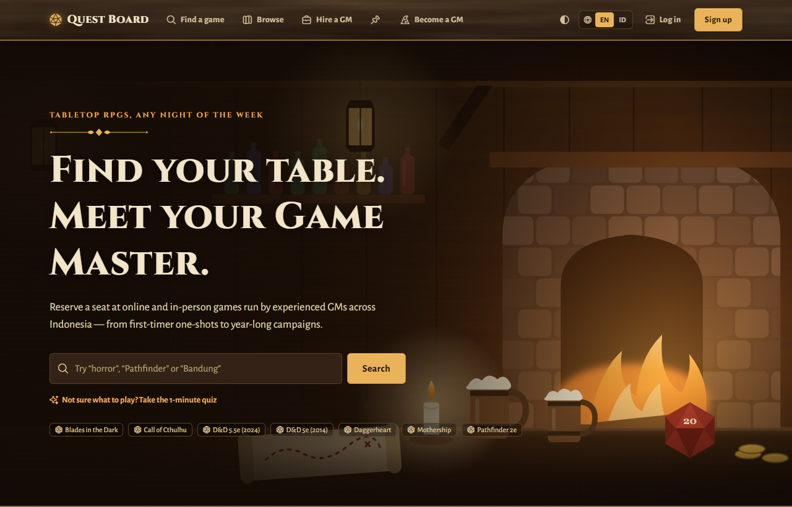
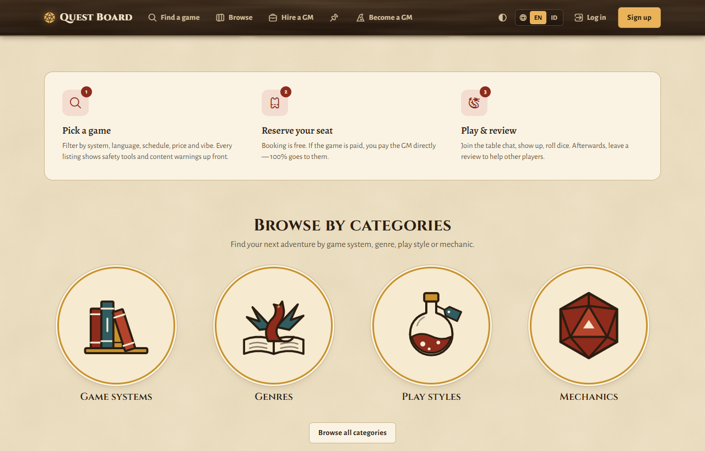
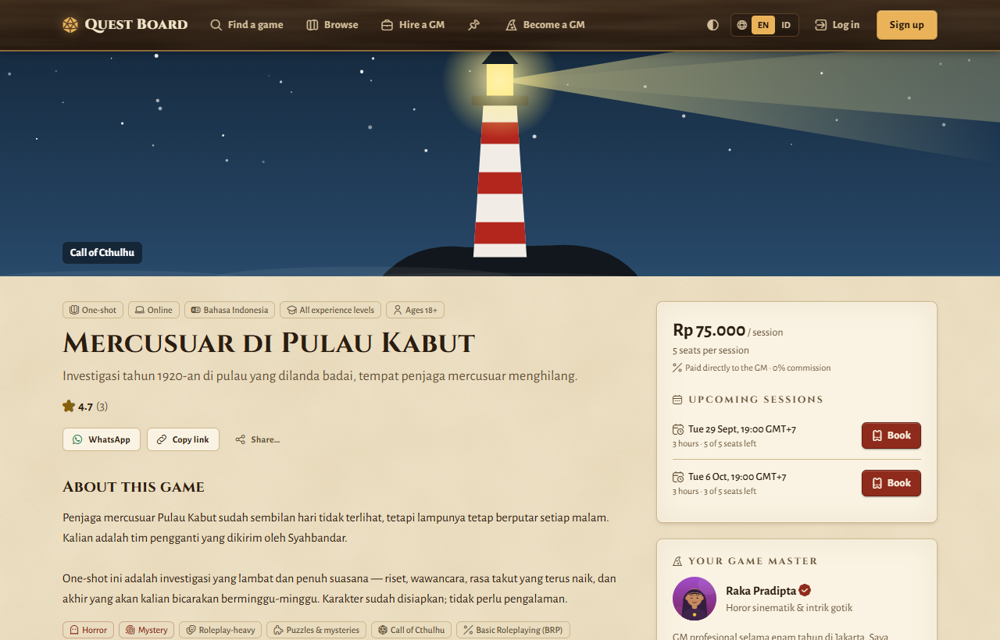
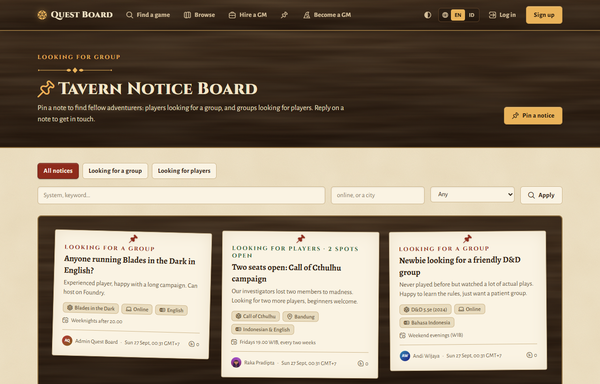
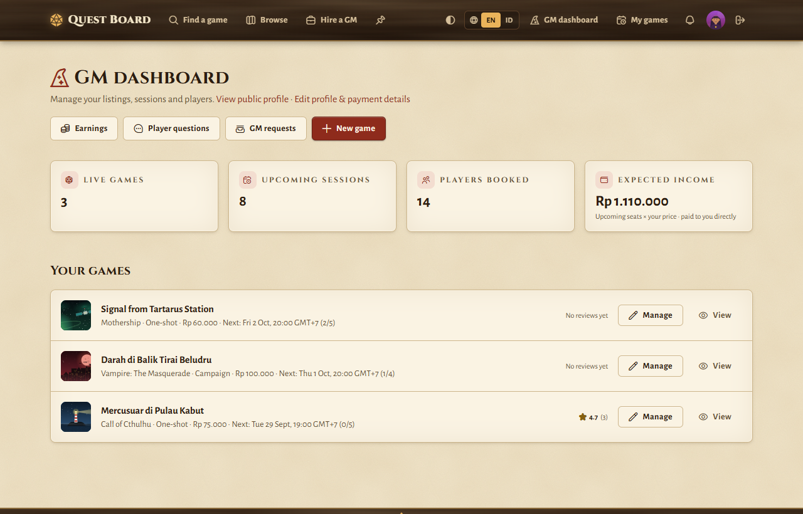
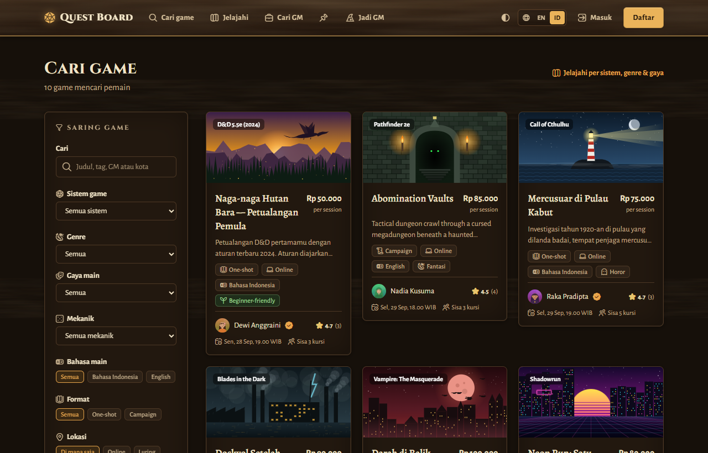
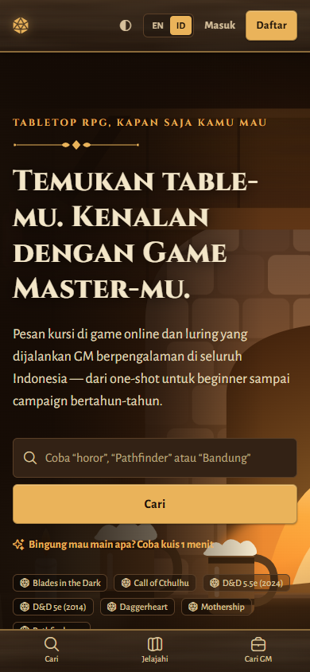

<div align="center">

# ⚔ Quest Board

**Find your table. Meet your Game Master.**

A bilingual (English / Bahasa Indonesia) marketplace where players in Indonesia find tabletop RPG games,
reserve seats and meet Game Masters, online or *luring* (in person).

[](https://github.com/addin12/Quest-Board/actions/workflows/ci.yml)


[](LICENSE)



</div>

## Why Quest Board

Inspired by [StartPlaying](https://startplaying.games) and rebuilt for Indonesia:

- **0% commission.** Game Masters set their own price in Rupiah and keep all of it.
- **Payments happen off-platform.** Players pay the GM directly (bank transfer, e-wallet, QRIS), using payment details that only booked players can see. Quest Board never touches the money.
- **Bilingual from day one.** Every page, email and reminder is in English or Bahasa Indonesia. The Indonesian was reviewed line by line by a native speaker.
- **Made for local play.** Prices in IDR, times in WIB, cities for in-person games, and play language (ID, EN or both) on every table.

## Features

**For players**
- Find games by system, genre, play style, **mechanic** (d20, Powered by the Apocalypse, OSR…), language, city, price and experience level, or take the one-minute **"What kind of adventurer are you?" quiz**.
- **Ask the GM a question** privately before booking, then **reserve a seat** in one step. Full sessions have a **waitlist** that holds a freed seat for the next person.
- **Table chat** with the GM and other players. **Reviews** after the session.
- **Reminders** by notification and email 24 hours and 1 hour before each session, plus a **personal calendar feed** for Google Calendar, Apple Calendar or Outlook.
- **Save** games and **follow** GMs to hear about their next table.

**For Game Masters**
- List games with cover art, categories (up to 3 genres and 3 styles), safety tools and content warnings. Schedule single sessions or a **weekly series**, and **duplicate** a game to run it again.
- A roster per session with a **"paid ✓"** tick, and an **Earnings** page (marked paid vs expected, seats to follow up, CSV download).
- **Cancel with a message** that reaches players in the app and by email.
- Answer **player questions** from an inbox, and take private groups through **Hire a GM** (requests, offers and a private chat).

**Community**
- The **Tavern Notice Board**: pin a note to find a group, or players for your table.
- Public GM profiles with ratings, verification badges and followers.

**Trust & safety**
- Reports on games, reviews, messages, notices and members, handled in an **admin console**: remove, suspend, dismiss, and verify GMs.
- Email verification, rate limits, security headers, an anti-scam note next to payment details, and **download my data / delete my account** (UU PDP, Indonesia's data protection law).

| Browse by categories | Game page |
|---|---|
|  |  |
| **Tavern Notice Board** | **GM dashboard** |
|  |  |

| Bahasa Indonesia, dark mode ("Candlelight") | Phone |
|---|---|
|  |  |

## Quick start

You need **Node.js 22.13 or later**. There's no database server to install: the app uses SQLite through Node's built-in `node:sqlite`.

```bash
cd web
npm install
npm run dev
```

Open http://localhost:3000. On first load the database is created and filled with Indonesian demo data (games, GMs, sessions and reviews).

| Demo account | Password | Try this |
|---|---|---|
| `player@questboard.test` | `tavern-demo-42` | Book a seat, see how to pay the GM, chat with the table, ask a GM a question |
| `gm@questboard.test` | `tavern-demo-42` | GM dashboard, earnings, schedule sessions, answer player questions |
| `admin@questboard.test` | `tavern-demo-42` | The admin console at `/admin` |

## Commands

Run these in `web/`:

| Command | What it does |
|---|---|
| `npm run dev` | Start the development server |
| `npm test` | Unit tests (`node:test`): rules, validation, i18n, migrations, calendars, earnings, security helpers |
| `npm run test:e2e` | Production build plus the Playwright suite: user journeys, accessibility (axe), broken links, and a second server on an empty database |
| `npm run typecheck` | TypeScript, which also fails if any Indonesian or English string is missing |
| `npm run lint` | ESLint, which also fails on hard-coded, untranslated text |
| `npm run admin -- create <email> "<Name>"` | Create an admin (production has no demo admin). Also `list`, `promote`, `demote` and `reset-2fa` (turn off two-step login after a lost phone) |
| `npm run db:backup` / `npm run db:restore -- <file> --yes` | A consistent backup while the app runs, and a restore that keeps the current database |
| `npm run db:reset` | Delete the local database so it's recreated with demo data |
| `npm run icons` · `npm run placeholders` · `npm run tavern-art` · `npm run app-icons` | Regenerate the icon subset, demo art, tavern illustrations and app icons |

## Tech stack

- **App:** Next.js 16 (App Router, server components and server actions), React 19, TypeScript, Tailwind CSS v4.
- **Data:** SQLite via `node:sqlite`, with versioned migrations that never wipe data.
- **Auth:** scrypt password hashes and database sessions.
- **Languages:** typed EN/ID dictionary; the language comes from a cookie or from `/en` and `/id` addresses.
- **Tests:** `node:test`, Playwright (Microsoft Edge locally, Chromium in CI) and axe.
- **Look:** Flaticon UIcons as a small subset font, and original tavern art drawn as SVG in code.

## Project layout

```text
Quest Board/
├── README.md            this page
├── CHANGELOG.md         what changed in each version
├── IMPROVEMENTS.md      prioritised backlog and everything done so far
├── ARCHITECTURE.md · CONVENTIONS.md · DESIGN.md · TESTING.md · MEMORY.md · CLAUDE.md
├── docs/                product & engineering specs (01–12) and screenshots
└── web/                 the app (Next.js + SQLite)
    ├── src/app/         pages, API routes and server actions
    ├── src/lib/         business rules, queries, i18n, schema & migrations
    ├── scripts/         admin, backups, art and icon generators
    └── tests/           unit (node:test) and end-to-end (Playwright)
```

## Documentation

| Read this | For |
|---|---|
| [docs/01 – 03](docs/01-product-requirements.md) | Product requirements, personas and user stories, functional spec |
| [docs/04](docs/04-technical-architecture.md) · [05](docs/05-data-model.md) · [06](docs/06-api-spec.md) | Architecture and decisions (ADRs), data model, public API |
| [docs/07](docs/07-ux-ui-spec.md) · [DESIGN.md](DESIGN.md) | UX flows, design tokens, the bilingual voice guide and Indonesian glossary |
| [docs/09](docs/09-testing-and-qa.md) · [TESTING.md](TESTING.md) | How it's tested, and the definition of done |
| [docs/10](docs/10-security-trust-safety.md) | Security, trust & safety, UU PDP notes |
| [docs/11](docs/11-operations-and-deployment.md) · [docs/12](docs/12-launch-checklist.md) | Deployment, the runbook, and the launch checklist |
| [ARCHITECTURE.md](ARCHITECTURE.md) · [CONVENTIONS.md](CONVENTIONS.md) | Code map, invariants and coding rules for contributors |

## Deploying

Quest Board runs as **one Node.js process with SQLite on a persistent disk**: a small server in Jakarta or Singapore behind an HTTPS reverse proxy is enough to start. In short:

- Run with `QUESTBOARD_SEED=false`, then create your admin with `npm run admin`.
- Set `QUESTBOARD_BASE_URL` and Resend keys (for email), and call `/api/cron/reminders` every few minutes.
- Back up nightly with `npm run db:backup`.

Every setting and step is in [docs/11](docs/11-operations-and-deployment.md) and the [launch checklist](docs/12-launch-checklist.md).

## Status

A feature-complete **pre-launch MVP**. What's left before launch are the owner's decisions and accounts (legal review, domain, hosting, email), listed in the [launch checklist](docs/12-launch-checklist.md). The remaining ideas, such as Postgres, photo uploads, WhatsApp reminders and a Discord bot, are in [IMPROVEMENTS.md](IMPROVEMENTS.md).

## Contributing

Start with [CLAUDE.md](CLAUDE.md), then [CONVENTIONS.md](CONVENTIONS.md) and [TESTING.md](TESTING.md). A change is done when `npm run typecheck`, `npm run lint`, `npm test` and `npm run test:e2e` all pass. New interface text needs both an English and an Indonesian string; the typecheck enforces this.

---

<sub>Icons: [Uicons by Flaticon](https://www.flaticon.com/uicons). Illustrations are original and drawn in code. Quest Board is an independent project, not affiliated with StartPlaying. It does not process payments: money is exchanged directly between players and Game Masters. Code licensed under the [MIT License](LICENSE); the Flaticon icons keep their own license (attribution required).</sub>
