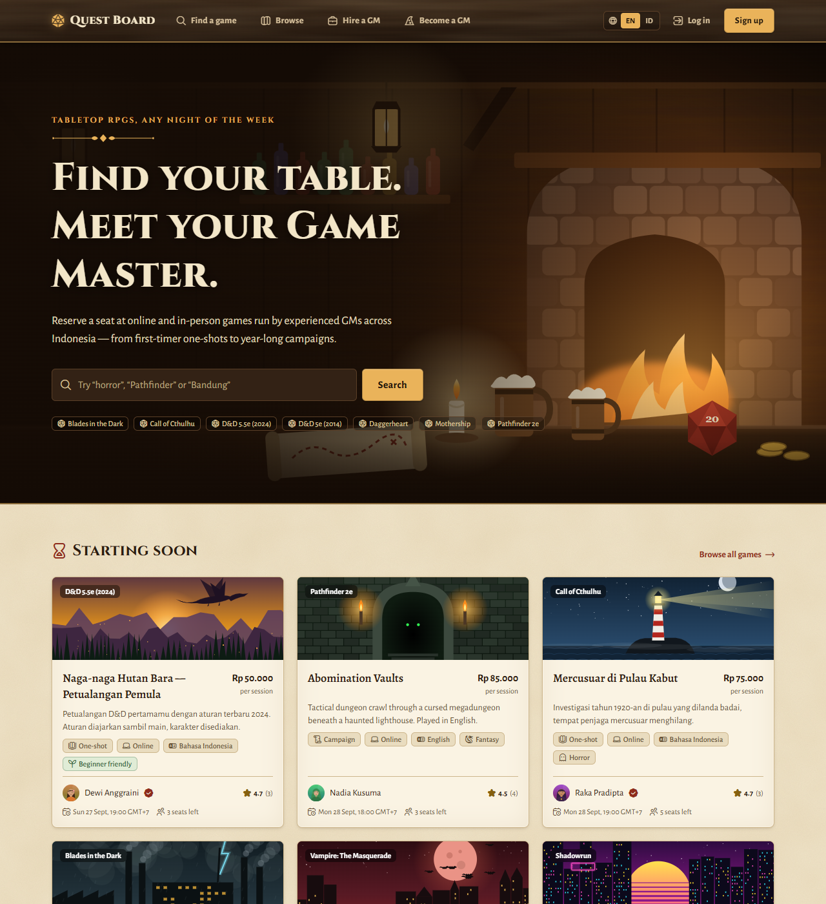
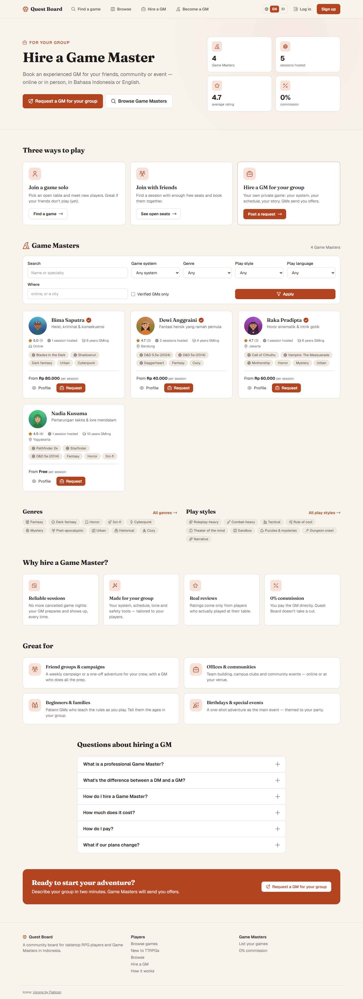
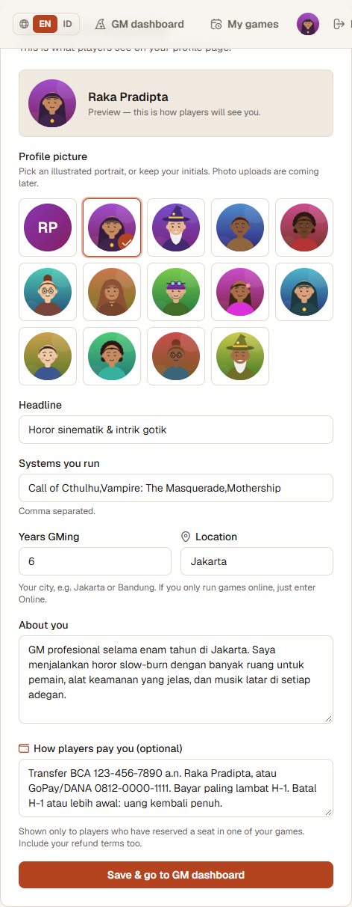
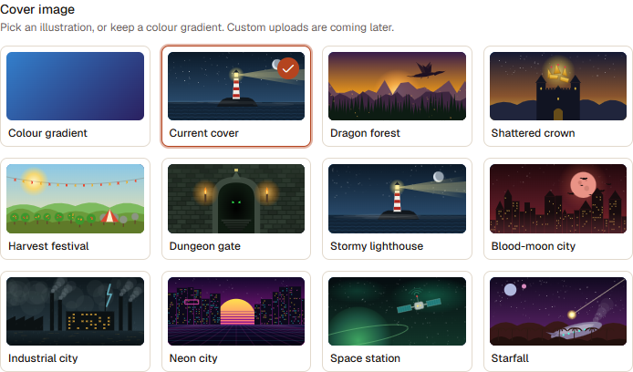
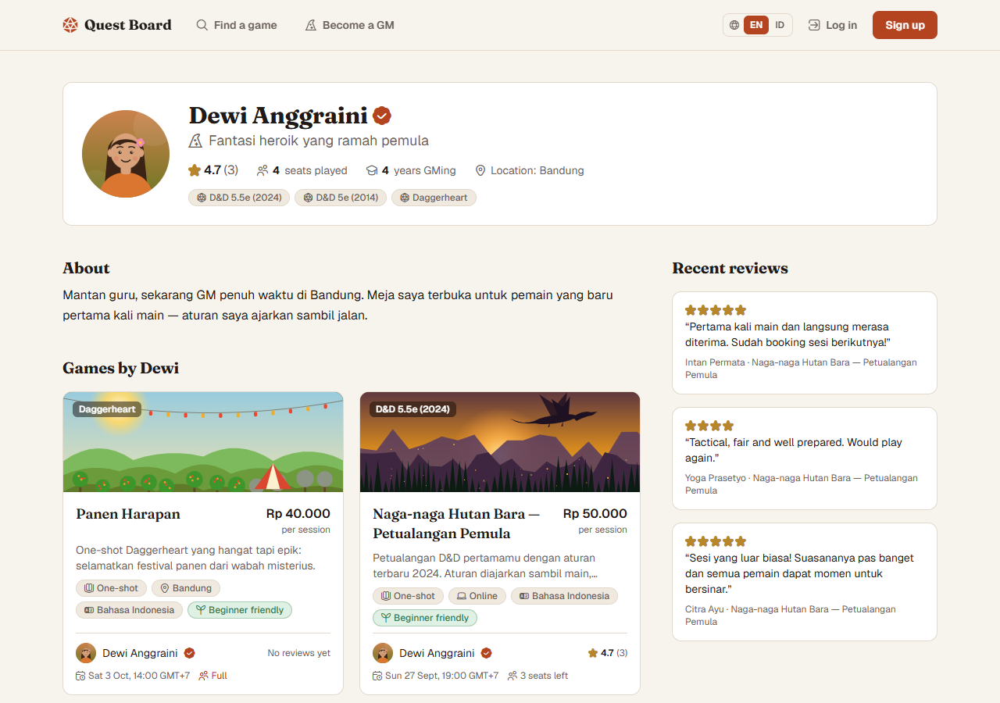
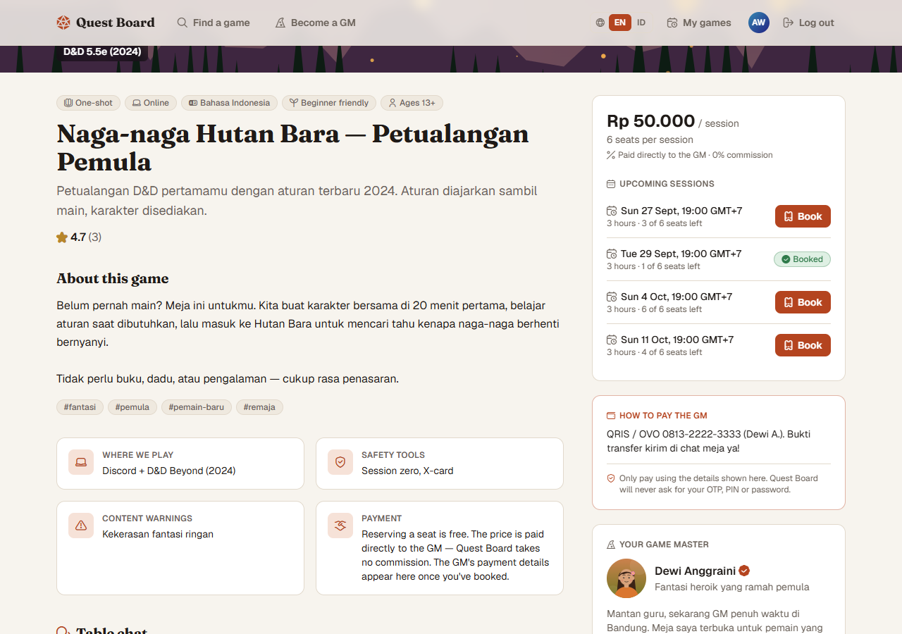
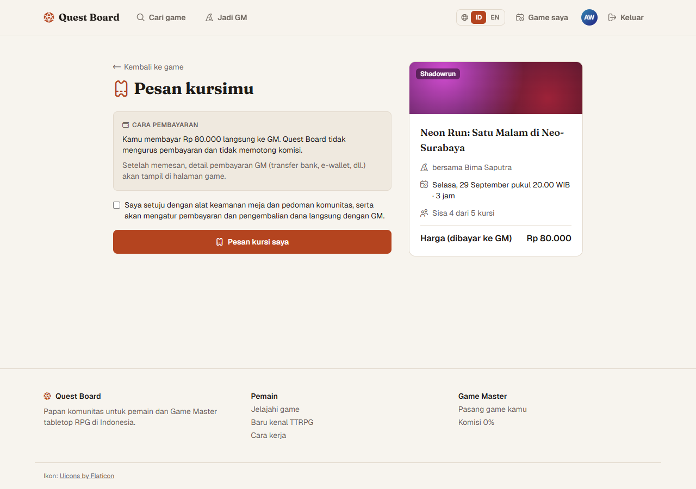
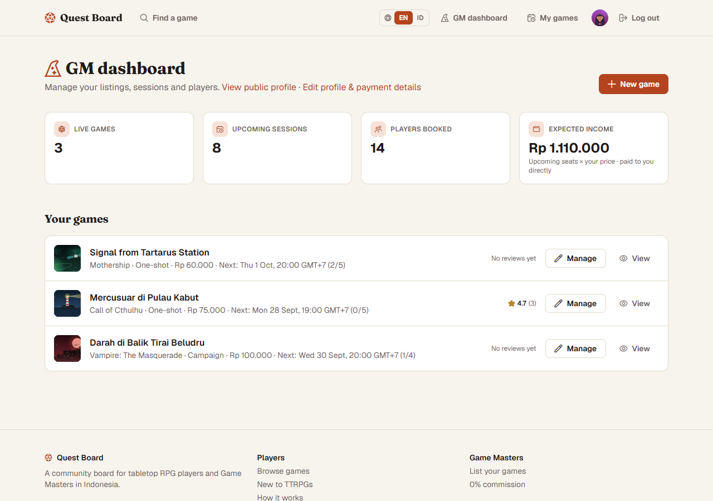
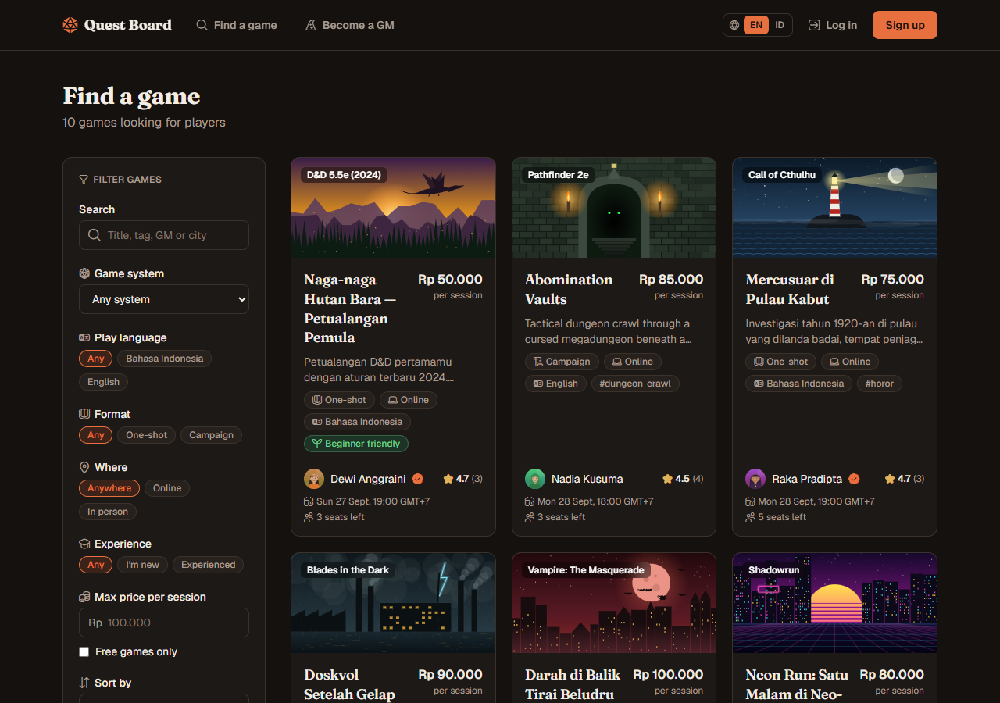
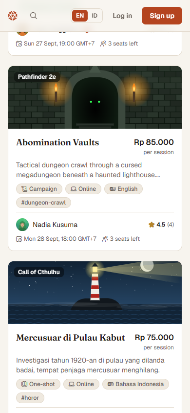

# ⚔ Quest Board

**A bilingual (English / Bahasa Indonesia) board where Indonesian players find tabletop RPG games and reserve seats with Game Masters.**

- **0% commission:** GMs set their own price in Rupiah and players pay them directly.
- Inspired by [StartPlaying](https://startplaying.games), rebuilt as an independent MVP for Indonesia with full product and engineering docs.



## What's new in v0.11 (in progress: the big upgrade)
Each iteration ships with its own quality check (review, typecheck, lint, unit + e2e + axe, and EN/ID light/dark mobile screenshots).
- **Iteration 1: Git + CI.** The repo is on branch `main`, and GitHub Actions runs every check on each push.
- **Iteration 2: sharing & calendars.**
  - WhatsApp, copy-link and native share buttons on games and GM profiles.
  - Tavern-style link previews (Open Graph images).
  - **Add to calendar** (Google Calendar or `.ics` with a 1-hour reminder) for booked sessions.
  - Table and request chats **refresh live** every 20 s.
- **Iteration 3: accounts & legal.**
  - Forgot/reset password (1-hour single-use link) and email verification. A verified email is required to post GM requests and offers.
  - **Download my data** (JSON) and **Delete account**, which releases seats, archives the GM's games, notifies everyone affected, and anonymises reviews and chats.
  - **Terms of Service** and **Privacy Policy** (UU PDP), marked as a draft until a lawyer reviews them.
  - Emails go to an outbox (`/dev/outbox` in development) and are delivered through Resend when `RESEND_API_KEY` is set.
- **Iteration 4: reports & admin console.**
  - A **Report** button on games, reviews, chat messages and GM profiles (reason + details).
  - **`/admin`** (admins only): reports queue with evidence snapshots (remove content / suspend / dismiss, and the reporter is told), GM verification, and member search with suspend/unsuspend.
  - Suspension blocks login, hides the GM profile, withdraws offers and archives games, and booked players are notified.
  - Demo admin: `admin@questboard.test`.
- **Iteration 5: waitlist, recurring sessions, paid ✓.**
  - Full sessions have a **waitlist**. A freed seat is held for the next person for 12 h (or until the session starts), then passes on. People can leave, or pass an offer to the next person.
  - GMs can add a **weekly series** (up to 12 sessions) in one go.
  - GMs tick **"paid ✓"** per seat. The player sees "The GM confirmed your payment" and is notified.
- **Iteration 6: Tavern Notice Board, saved games, follows.**
  - **`/board`:** parchment notes pinned to an oak board, either "Looking for a group" or "Looking for players".
    - Filters, public replies (the author is notified), take-down, and a 30-day expiry.
    - Posting needs a verified email, and notices and replies can be reported.
  - **Save** games (they show in My games) and **follow** GMs, whose next published game notifies followers once.
  - The phone tab bar now covers widths below 768 px, and the header never wraps (checked from 640 to 1536 px for every role).

## What changed in v0.10 (tavern look + notification popover)
- **Medieval tavern design:** parchment and ink by day, a candlelit dark-oak room at night.
  - Wooden signboard header and footer with a brass trim.
  - Cinzel and Alegreya lettering.
  - Wax-seal buttons and parchment cards.
  - A hand-drawn (SVG) candlelit tavern scene on the home page.
  - All of it passes the WCAG AA contrast checks.
- **The notification bell opens a popover** with the latest notifications; "See all" opens the full page.


## What changed in v0.9.1 (quality pass)
- **In-app notifications:** a bell in the header shows the unread count, and `/notifications` lists events: offers, being chosen, direct requests, new request messages, seat bookings and cancellations, and GM-cancelled sessions. Email and WhatsApp delivery come later.
- **Mobile bottom tab bar** (Find, Browse, Hire a GM, My games, GM). The signed-in header no longer overflows on phones.
- **Accessibility:**
  - Every form error is linked to its field (`aria-invalid` + `aria-describedby`).
  - A new automated **axe** test checks the main pages in EN and ID, light and dark.
  - Two colour tints were lightened to pass contrast.
- **Hire-flow fixes:** a matched request can't be closed, so its chat and payment details stay. Choosing or closing twice does nothing. GMs need a finished profile before they can offer. GM bios keep their 30-character minimum in Settings.
- **Browse:** every known game system has a page, even with no open tables yet.
- **Indonesian copy** reviewed and 15 strings improved. A native-speaker review is still recommended.
- Schema **v8** (migration): `notifications`.

## What changed in v0.9 (settings, browse, hire a GM)
- **Profile settings for players and GMs** at `/settings` (the avatar in the header links there).
  - Change your display name, "about you", language and illustrated portrait (players can now pick one too).
  - Change your password. This signs out your other devices.
  - Log out everywhere.
  - GMs also get links to their GM profile, payment details and requests.
- **Browse by category** at `/browse`.
  - **Game systems** show cover cards and a short blurb, with 10 systems described.
  - **Genres** (10) and **play styles** (9) each have an icon.
  - Each category has its own page, `/browse/genre/horror`, `/browse/style/sandbox` or `/browse/system/dnd-5-5e-2024`, listing its games and top GMs.
  - GMs tag each game with up to 3 genres and 3 styles, and `/games` gains genre and style filters.
- **Hire a Game Master** at `/hire-a-gm`, modelled on StartPlaying's "hire a professional DM" page.
  - The page has a hero with stats, "three ways to play", and a filterable GM directory (system, genre, style, language, location, verified).
  - It also covers why hire, use cases, an FAQ and a CTA.
  - Unlike StartPlaying, Quest Board adds a **request flow**:
    1. A player posts a request, open to all GMs or sent directly from a GM's profile.
    2. GMs reply with an offer (a message plus a price per player per session).
    3. The player chooses one.
    4. A private chat opens, and the player sees that GM's payment details.
  - Still **0% commission**: the player pays the GM directly.
- Schema **v7** (migration): `games.genres` and `games.styles`, plus `gm_requests`, `gm_request_offers` and `gm_request_messages`. Existing databases migrate and keep their data.



## What changed in v0.8 (portrait picker)
- **GMs can choose an illustrated profile picture** instead of initials, from 12 portraits in the GM profile form.
  - The styles are a wizard with a beard, short hair, curly hair, a bun with glasses, a hijab, a beanie with goggles, a flower in long hair, and a hood, across a range of skin tones.
  - A live preview shows how players will see the GM.
- The server only accepts portraits from the built-in library.
- The cover and portrait pickers now share one accessible picker component.



## What changed in v0.7 (cover picker)
- **GMs can choose cover art for their own games.** The new-game and edit forms have a visual picker with 10 illustrations (dragon forest, shattered crown, harvest festival, dungeon gate, stormy lighthouse, blood-moon city, industrial city, neon city, space station, starfall), or a colour gradient.
- The server only accepts covers from the built-in library, so no arbitrary image URLs.



## What changed in v0.6 (artwork)
- **Every demo game has its own cover illustration**, and **every demo GM has a portrait**. There are 10 themed scenes: a storm lighthouse, a vampire city, a space station, a dragon over a forest, a shattered crown, a harvest festival, an industrial city, a neon city, a dungeon and a crashed alien ark.
- The art is original, drawn in code as SVG by `npm run placeholders` (about 174 KB total). It needs no licence or credit and is served locally.
- Games and users now have an optional image field. Anything without art keeps the colour-gradient cover or the initials avatar.



## What changed in v0.5 (hardening)
All high-priority items from [IMPROVEMENTS.md](IMPROVEMENTS.md) are fixed:
- **Seats:** no overbooking through seat edits, and archiving a game releases its seats.
- **Chat:** shows the newest messages.
- **Safer errors:** friendly messages instead of crashes.
- **Search:** literal `%` and `_`.
- **Data:** real database migrations, so data is never wiped.
- **Security:** rate limits, session hygiene, "Log out on all devices", security headers, and an anti-scam note by payment details.
- **Forms:** they now keep what you typed after an error.

## What changed in v0.4

| Feedback | Result |
|---|---|
| English as the default language | Every first visit is in **English**, including from Indonesian-language browsers. Visitors switch to Bahasa Indonesia with the **EN / ID** switcher in the header, and the choice is remembered. |
| Replace timezone with location | GM profiles now have a **Location** field instead of Timezone. GMs enter their city (Jakarta, Bandung…), or **Online** if they only play online; suggestions are offered. Profiles show "Location: Jakarta" or "Location: Online". |

## What changed in v0.3

| Feedback | Result |
|---|---|
| Split D&D 5e by edition | Two systems, **D&D 5e (2014)** and **D&D 5.5e (2024)**, each with its own filter. A keyword search for "D&D" still finds both. The demo data has one table of each. |
| Flaticon icons | **Flaticon UIcons** throughout: header, cards, filters, game pages, dashboards, buttons, notices. They are subset to just the 52 icons used (about 6.5 KB instead of about 690 KB) and credited in the footer ("Uicons by Flaticon") as the free license requires. |

## What changed in v0.2

| Feedback | Result |
|---|---|
| Remove monetisation and payments | No checkout, fees or refunds on the platform. A booking is a free seat reservation. The GM keeps **100%**, and players pay the GM directly using the GM's own payment details (bank transfer, e-wallet, QRIS), which are visible only to players who have booked. |
| Currency IDR | All prices are whole Rupiah (`Rp 75.000`). Inputs accept `75.000`. The demo data is Indonesian (Jakarta, Bandung, Yogyakarta; WIB times). |
| Bilingual | The full UI is in **English** and **Bahasa Indonesia**, with a language switcher in the header (English became the default in v0.4). Each game has a play language (ID / EN / both) with a matching filter. |

## For contributors & AI agents
Start with [CLAUDE.md](CLAUDE.md). It links working guides that are kept short and current:

| File | Purpose |
|---|---|
| [MEMORY.md](MEMORY.md) | Product decisions log (why things are the way they are), intentional quirks, open questions |
| [ARCHITECTURE.md](ARCHITECTURE.md) | Code map, data model, invariants, step-by-step recipes |
| [DESIGN.md](DESIGN.md) | Tokens, components, icon map, voice (EN/ID), accessibility |
| [CONVENTIONS.md](CONVENTIONS.md) | Coding rules (Next 16, i18n, SQL, money, time, Tailwind v4) |
| [TESTING.md](TESTING.md) | Suites, e2e seed-data tips, screenshots, definition of done |
| [IMPROVEMENTS.md](IMPROVEMENTS.md) | Prioritised backlog from the latest review |

## Folder layout

```
Quest Board/
├── README.md
├── docs/                         product docs, planning & specs
│   ├── 01-product-requirements.md    vision, Indonesian market, scope, (no-)business model, metrics
│   ├── 02-personas-and-user-stories.md
│   ├── 03-functional-spec.md         roles, language rules, IDR, reservations, payment-details visibility
│   ├── 04-technical-architecture.md  stack, diagrams, ADRs (incl. i18n & no-payments)
│   ├── 05-data-model.md              ERD v2, v1→v2 changes, seed data
│   ├── 06-api-spec.md
│   ├── 07-ux-ui-spec.md              flows, design tokens, bilingual voice guide
│   ├── 08-roadmap-and-plan.md
│   ├── 09-testing-and-qa.md
│   ├── 10-security-trust-safety.md   incl. PDP Law notes, anti-scam
│   ├── 11-operations-and-deployment.md
│   └── screenshots/
└── web/                          the MVP app (Next.js 16 + SQLite)
```

## Quick start

Requires **Node.js 22.13+**. No database server needed.

```bash
cd web
npm install
npm run dev
```

Open http://localhost:3000. The database is created and seeded with Indonesian demo data on first load. If you ran v0.1 before, the old database is backed up automatically.

| Demo account | Password | Try this |
|---|---|---|
| `player@questboard.test` (Andi) | `password123` | Reserve a seat → see "Cara bayar ke GM" → table chat → cancel; review a past game |
| `gm@questboard.test` (Raka) | `password123` | GM dashboard (expected income in Rp), edit payment details, create a game, schedule sessions |
| `admin@questboard.test` | `password123` | Manage any game |

Commands (in `web/`):

```bash
npm test            # 39 unit tests (rules, IDR, validation, i18n, migrations, rate limiting, LIKE escaping, icons, artwork, D&D editions)
npm run test:e2e    # production build + 25 Playwright journeys (EN & ID, incl. security regressions)
npm run placeholders # regenerate the demo cover art & GM portraits (public/images); uses installed Edge (PW_CHANNEL=chrome for Chrome)
npm run icons       # regenerate the Flaticon icon subset after editing src/lib/icons.ts
npm run lint
npm run typecheck   # also fails if any Indonesian/English string is missing
npm run db:reset
```

| Game page (member view) | Reserve (no payment step) | GM dashboard |
|---|---|---|
|  |  |  |

| English + dark mode | Mobile |
|---|---|
|  |  |

## Tech in one line
Next.js 16 App Router (server components + server actions) · React 19 · TypeScript · Tailwind v4 · Node's built-in `node:sqlite` · typed ID/EN dictionary with cookie-based locale · Flaticon UIcons (subset font) · scrypt + DB sessions · node:test + Playwright.

---
*Icons: [Uicons by Flaticon](https://www.flaticon.com/uicons). Quest Board is an independent project, not affiliated with StartPlaying. Quest Board does not process payments. Money is exchanged directly between players and Game Masters.*
