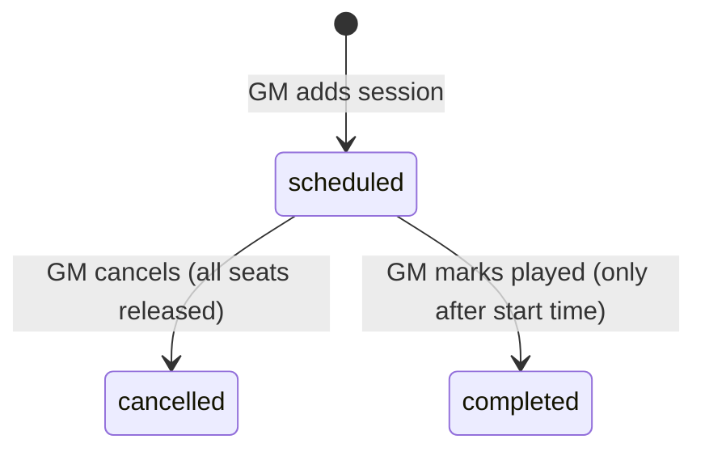
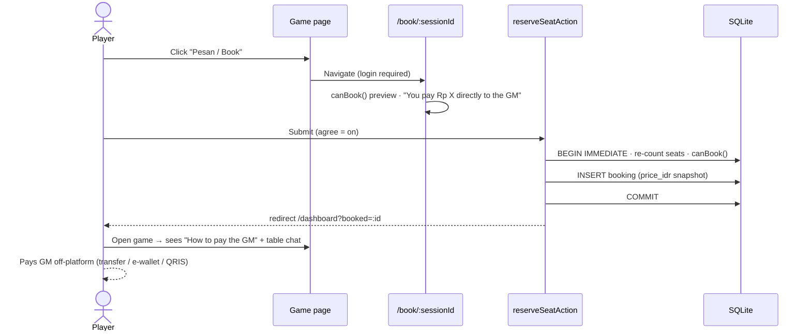

# 03 · Functional Specification

This document defines how every MVP feature behaves. The source of truth is code:

| File | Contents |
|---|---|
| `web/src/lib/policy.ts` | Business rules: bookability, cancellation, IDR formatting |
| `web/src/lib/validation.ts` | Input rules; returns translation keys |
| `web/src/lib/i18n/dict.ts` | Every UI string in ID and EN |

> **Money principle:** Quest Board never handles money. A price is information set by the GM. Payment, refunds and receipts are arranged directly between the player and the GM. The platform takes **0% commission**.

---

## 1. Roles & permissions

| Capability | Visitor | Player | GM | Admin |
|---|:-:|:-:|:-:|:-:|
| Browse, search, view games & GM profiles | ✓ | ✓ | ✓ | ✓ |
| Switch language (ID / EN) | ✓ | ✓ | ✓ | ✓ |
| Public JSON API | ✓ | ✓ | ✓ | ✓ |
| Reserve / give up own seats | – | ✓ | ✓ (not in own games) | ✓ |
| See a GM's payment details | – | only for games they hold a seat in | own | ✓ ¹ |
| Review games they played | – | ✓ | ✓ | ✓ |
| Post in table chat (member only) | – | ✓ | ✓ | – ¹ |
| Create / edit GM profile | – | ✓ (becomes GM) | ✓ | ✓ |
| Create / edit / archive listings; schedule / cancel / complete sessions | – | – | own only | any |

¹ Admins can open management pages. Chat and payment details still follow the membership rules, except that an admin who owns the game counts as a member.

All authorization is enforced **on the server**, in the page or server action itself.

## 2. Language & locale

| Aspect | Rule |
|---|---|
| Supported | `en` (English, **default**) and `id` (Bahasa Indonesia) |
| Resolution order | `qb_lang` cookie → otherwise **English**. The browser's `Accept-Language` is intentionally not used, so every first visit is English. |
| Switcher | Header "EN / ID" buttons (a form posting to `setLanguageAction`). Sets a cookie for 1 year and re-renders the current page. Works without JS. |
| `<html lang>` | Matches the active language |
| What is translated | All UI chrome, labels, buttons, validation and business errors, confirmation dialogs, metadata titles, and empty states |
| What is *not* translated | User content: game titles, descriptions, tags, GM bios, chat, reviews, payment details |
| Play language | Each game declares `id`, `en` or `both`, shown as a chip. Filter `language=id` matches `id` and `both`; `language=en` matches `en` and `both`. |
| Dates & times | Stored in UTC. Formatted with `id-ID` or `en-GB` in the **viewer's timezone**. Server-rendered HTML uses `Asia/Jakarta` (WIB), and the client re-renders in the browser zone. Times include the zone name (WIB/WITA/WIT). |
| Currency | IDR only, in whole Rupiah (no minor unit). Format: `Rp 75.000` (Intl `id-ID`) in both languages. 0 is shown as "Gratis" or "Free". |
| Price input | Accepts `75.000`, `75,000`, `Rp 75.000` or `75000`: all non-digits are stripped. Empty means 0. |

## 3. Accounts
- **Sign up:** role (Main game / Jadi GM), display name (2–50 characters), email (case-insensitive), password ≥ 8 characters. Any role other than `gm` becomes `player`. A GM sign-up creates an empty `gm_profiles` row.
  - **Verify first** (so sign-up never reveals whether an address is registered): every sign-up ends on `/signup/check-email`. A new address gets a confirmation link; its page has a **Confirm my email** button (a POST, so mail scanners that open links don't use it up), which confirms the address, signs the person in the first time, and goes on to `/gm` for GMs or the page they came from. An address that already has an account creates nothing: its owner gets “Someone tried to sign up with your email” (log in / reset links, no sign-in link; at most twice an hour per address).
  - Password login still works before confirming; confirming is needed to post GM requests, notices and questions.
- **GM removes a player** from an upcoming session (`removePlayerAction`, optional message ≤ 300 chars): the seat is released and offered to the waitlist; the player gets a notification (`seat_removed`) and an email with the message; they can't book or wait-list that session again (`canBook` → `err.removedByGm`).
- **Log in:** the same error for an unknown email and a wrong password (`err.badLogin`). `?next=` accepts only same-site relative paths.
- **Session:** a 30-day httpOnly, SameSite=Lax cookie `qb_session` holding a random 256-bit token. Only its SHA-256 hash is stored.

## 4. Game listing

| Field | Rule |
|---|---|
| Title | 4–80 characters. Generates a unique slug |
| System | Required. Free text with a datalist of common systems. **D&D is split by edition:** `D&D 5.5e (2024)` (revised 2024 rules) and `D&D 5e (2014)`. There is no bare "D&D 5e" option |
| Summary | 10–160 characters |
| Description | ≥ 30 characters. Line breaks are preserved |
| Format | `one_shot` \| `campaign` |
| Location | `online` → **platform required** · `in_person` → **city required** |
| Play language | `id` (default) \| `en` \| `both` |
| Price | **Rp 0 – Rp 10.000.000** per seat per session, as an integer |
| Seats | 1–12 per session |
| Experience | `any` \| `beginner` \| `experienced` |
| Minimum age | 0–99 (default 18) |
| Safety tools / content warnings / tags | Optional free text |
| Cover image | `""` (colour gradient) or one of 10 library illustrations picked in the form. The server allow-lists the value (`isAllowedCover`), and demo games may keep their own art |
| Cover hue | 0–359. Drives the gradient (used when no illustration is chosen, and while images load) |
| Status | `draft` · `published` · `archived` |

A draft is visible only to its owner or an admin, with a notice. For everyone else it returns 404.

## 5. GM profile & payment details
- Fields: **profile picture** (initials, or one of 12 library portraits; allow-listed server-side), headline (≥ 5 characters), systems, years (0–60), **location**, bio (≥ 30 characters), and **payment details** (optional, ≤ 500 characters).
- **Location** replaces the former timezone field (v0.4).
  - It holds the GM's city (e.g. "Jakarta", "Bandung"), or **"Online"** if they only play online. The input suggests Online plus major Indonesian cities.
  - It is normalised by `normalizeLocation()`: whitespace is tidied, the value is capped at 60 characters, and empty input or any casing of "online" becomes "Online".
  - The public profile shows "Location: <city>" with a map-marker icon, or "Location: Online" (translated) with a laptop icon.
  - This is separate from each game's own online / in-person city.
- Payment details are free text, for example "BCA 123-456-7890 a.n. Raka · GoPay 0812-… · bayar H-1 · refund penuh jika batal ≥ H-1".
- **Visibility:** shown in a "Cara bayar ke GM / How to pay the GM" card on a game page **only** when the viewer is a member of that game and is not the GM. They never appear on the public profile, in search, or in the API.
- The platform does not validate, verify or process these details.

## 6. Sessions

- Created in the GM's browser timezone. The client sends `getTimezoneOffset()` and the server stores UTC. The time must be in the future.
- Duration can be 30–720 minutes. The UI offers 2–6 hours.
- A session that has started but is still `scheduled` appears under **Perlu diselesaikan / Needs wrap-up**.

## 7. Reservations (bookings)

### 7.1 Bookability (`canBook`)
All of these must hold, checked in order. The first failure's reason is shown as a translated message:

| # | Rule | Reason key |
|---|---|---|
| 1 | Viewer is not the game's GM | `err.ownGame` |
| 2 | Game is `published` | `err.notAccepting` |
| 3 | Session is `scheduled` | `err.notScheduled` |
| 4 | Session hasn't started | `err.started` |
| 5 | Viewer has no active seat in this session | `err.alreadyBooked` |
| 6 | Confirmed seats < seats total | `err.full` |

### 7.2 Reserve flow

- There are no card fields and no payment step. The checkbox acknowledges the safety tools, the community guidelines, and that payment and refunds are arranged with the GM.
- `price_idr` is copied onto the booking at reservation time, which feeds the GM's expected-income figure.
- Concurrency: `BEGIN IMMEDIATE` + partial unique index `uq_booking_active`.

### 7.3 Cancellation

| Who | When | Booking becomes | Money |
|---|---|---|---|
| Player | Any time before start | `cancelled`, `cancelled_by = 'player'` | Between player and GM (per the GM's stated terms) |
| Player | After start | not allowed | – |
| GM | Session is `scheduled` | all confirmed → `cancelled`, `cancelled_by = 'gm'` | GM should refund anyone who paid |

The confirmation dialogs remind both sides to settle refunds directly.

## 8. GM dashboard metrics

| Tile | Definition |
|---|---|
| Live games | Published games |
| Upcoming sessions | Scheduled sessions in the future |
| Players booked | Confirmed seats in upcoming scheduled sessions |
| Expected income | Σ `bookings.price_idr` of confirmed seats in upcoming scheduled sessions. Informational only, "paid to you directly". |

## 9. Reviews
- One per (game, player). Allowed once the player has a confirmed seat in a session of that game that has started or been completed.
- Rating 1–5, text ≤ 2000 characters. Game rating is the average to 1 decimal place. GM rating is the average across their games.

## 10. Table chat
- Visible to members only (the owning GM, or a player with ≥ 1 confirmed seat in any session of the game).
- 1–1000 characters. The latest 200 messages are shown, oldest first. GM messages carry a badge. There are no live updates yet.

## 11. Empty & error states (both languages)

| Where | ID | EN |
|---|---|---|
| Browse, no results | "Tidak ada game yang cocok" | "No games match those filters" |
| Game, no sessions | "Belum ada sesi terjadwal…" | "No sessions scheduled right now…" |
| Payment details missing | "GM belum menambahkan detail pembayaran — tanyakan di chat meja." | "The GM hasn't added payment details yet — ask in the table chat." |
| Dashboard, none upcoming | "Belum ada game mendatang" | "No upcoming games" |
| 404 | "Natural 1." | "Natural 1." |

## 12. Profile settings (v0.9)
- `/settings` requires login and is available to players and GMs.
- **Profile:** display name (2–50), "about you" (≤ 2000), portrait (initials or one of the library portraits; server allow-list), and language (sets `qb_lang`). Email is read-only.
- **Password:** requires the current password; the new one must be ≥ 8 characters and different. On success, all sessions are destroyed and a new one is created for this device. Rate limit: 5 per 15 min.
- **Security:** "Log out on all devices" (moved from the dashboard).
- **GM section:** links to the GM profile form, the public profile and the request inbox, or a "Become a GM" CTA.

## 13. Browse by category (v0.9)
- **Taxonomy:** 10 genres and 9 play styles (`lib/categories.ts`). A GM picks ≤ 3 of each per game; extra checkboxes are disabled at the cap, and the server normalises (known keys only, deduped, capped).
- **`/browse`:** system cards (each system with ≥ 1 published game, with a count and blurb), plus genre and style tiles with counts.
- **`/browse/genre/<key>`, `/browse/style/<key>`, `/browse/system/<slug>`:** published games (soonest first), up to 3 GMs, and sibling chips. An unknown value returns 404.
- **`/games`:** new `genre` and `style` query filters.

## 14. Hire a Game Master (v0.9)
- **`/hire-a-gm`:** landing page and directory. The directory lists GMs with a headline, filterable by keyword, system, genre, style, play language, location ("online" or a city) and verified only.
- **Request (`/hire-a-gm/request`, login required):** title (5–80), system (optional), group size 1–12, experience, language, online or in person (city required for in person), schedule, optional budget in Rp, and details (20–2000). With `?gm=<id>` the request is **direct** (only that GM sees it). Rate limit: 5/h.
- **Offers:** any GM (not the requester) may send one offer per open request: a message (10–1000) and a price per player per session in Rp. Rate limit: 30/h.
- **Choosing:** the requester chooses one offer, and the request becomes `matched`. The requester can close an open request at any time.
- **After a match:** a private thread between the requester and the matched GM, and the GM's payment details plus the anti-scam note, shown to the requester only.
- **Visibility:** requester; any GM for open requests (target GM only for direct ones); GMs who have offered (they see whether they were chosen). Anyone else gets 404.
- **GM inbox (`/gm/requests`):** matched requests first, then open ones (direct ones first) with "Sent to you" and "Offer sent" badges. The GM dashboard shows the open count.

## 15. Notifications (v0.9.1)
| Event | Who is notified | Links to |
|---|---|---|
| Direct GM request created | the target GM | request |
| Offer sent | requester | request |
| Offer chosen | chosen GM | request |
| Message in a matched request (collapsed while unread) | the other party | request |
| Seat reserved / cancelled by the player | the game's GM | GM dashboard |
| Session cancelled by the GM | every player who had a seat | game page |

- Nobody is notified about their own action.
- Unread count shows on the header bell. Opening `/notifications` marks all as read, and opening a request marks that request's notifications as read.
- GMs also see a card with the number of open requests they haven't answered.
- Delivery is in-app only for now.
