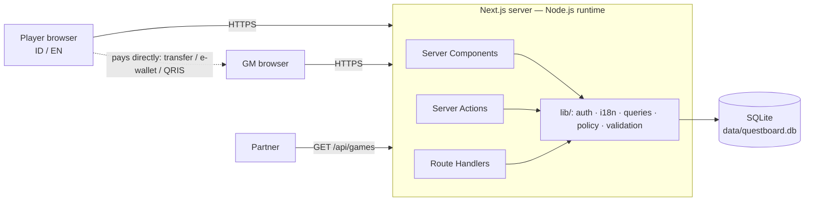

# 04 · Technical Architecture

## 1. Stack

| Layer | Choice | Why |
|---|---|---|
| Framework | **Next.js 16** (App Router, React 19, Turbopack) | Server components and server actions put UI and backend in one codebase |
| Language | TypeScript (strict) | Type safety across the DB → UI boundary, **including translation keys** |
| Styling | Tailwind CSS v4 + CSS custom-property design tokens | Fast iteration, dark mode |
| Icons | **Flaticon UIcons** (`@flaticon/flaticon-uicons`), subset to the glyphs we use | Consistent icon family; about 6.5 KB of fonts instead of about 690 KB |
| Database | **SQLite via Node's built-in `node:sqlite`** | No native build or ORM. Portable SQL |
| i18n | Custom typed dictionary (`lib/i18n/dict.ts`) + cookie-based locale | ~2 languages, ~300 strings: no library needed. Missing keys fail the type check |
| Auth | scrypt password hashes + DB-backed session tokens | No third-party dependency |
| Payments | **None.** Players pay GMs directly | Product decision (0% commission) |
| Tests | `node:test` (unit) + Playwright (e2e, against local Edge or Chrome) | |

Runtime: **Node ≥ 22.13** (developed on 24). Runtime dependencies are `next`, `react`, `react-dom` and `server-only`.

## 2. System context



The dotted arrow is the only money flow, and it happens outside the system.

## 3. Code layout (`web/`)

```
src/
  app/
    actions.ts               # ALL server actions (language, auth, games, sessions, reservations, chat, reviews)
    layout.tsx               # shell: <html lang>, I18nProvider, header with ID/EN switcher, footer
    page.tsx                 # home
    games/page.tsx           # browse + filters (incl. play language, Rp max price)
    games/[slug]/page.tsx    # game detail, sessions, members-only payment card + chat, reviews
    book/[sessionId]/        # reserve a seat (no payment)
    dashboard/  gms/[id]/  become-a-gm/  gm/…  login/  signup/  how-it-works/  api/games/…
  components/
    i18n-provider.tsx        # client context → useI18n() { lang, t }
    ui.tsx                   # presentational (takes `t` from server pages): GameCard, Stars, priceLabel…
    local-time.tsx           # viewer-timezone dates, locale-aware
    icon.tsx                 # <Icon name solid? label?> — Flaticon UIcons glyph
    *-form.tsx               # client forms (translate FormState keys with t())
  lib/
    i18n/dict.ts             # ID + EN dictionaries, MsgKey type, makeT() (pure)
    i18n/server.ts           # getLang() / getI18n() — cookie → "en" (default)
    policy.ts                # pure rules: canBook, canCancel, formatIdr, parseIdr, slugify
    icons.ts                 # registry of Flaticon UIcons names (drives the font subset)
    validation.ts            # pure parsers returning translation keys
    db.ts schema.ts seed.ts auth.ts password.ts queries.ts
tests/unit/                  # node:test — policy, validation, i18n completeness
tests/e2e/                   # Playwright journeys (EN and ID locales)
```

## 4. Key design decisions (ADRs)

**ADR-1 · Server actions for mutations.** Each action re-authenticates and re-authorizes. A small read-only REST API serves partners.

**ADR-2 · SQLite, raw parameterised SQL.** Dynamic `ORDER BY` and `WHERE` fragments come only from fixed allow-lists.

**ADR-3 · Pure logic modules.** `policy.ts`, `validation.ts` and `i18n/dict.ts` have no runtime imports (only `import type`), so `node --test` runs them directly.

**ADR-4 · UTC storage, local display.** `<LocalTime>` renders WIB on the server and the viewer's zone after hydration. For Indonesian viewers these are usually identical, so nothing flickers.

**ADR-5 · No money handling (v0.2).** There are no payment, fee or refund tables. `bookings.price_idr` is a snapshot for information only. GM payment instructions are free text on `gm_profiles.payment_info`, rendered only for members. This removes PCI scope, payment licensing (Bank Indonesia / OJK) and payout operations from the MVP.

**ADR-6 · Concurrency.** Reservations run in `BEGIN IMMEDIATE`, with a partial unique index on active seats.

**ADR-7 · i18n without URL prefixes.** The locale lives in a cookie rather than `/id/...` or `/en/...` routes.
- *Pros:* no route duplication, and links stay stable when the language changes.
- *Cons:* search engines index one language per URL (English, the default).
- *Revisit:* if SEO for English queries matters, add `[lang]` route segments + `hreflang` (Next's i18n guide pattern). The dictionary and `getI18n()` can be reused unchanged.

**ADR-8 · Typed translation keys.** `MsgKey = keyof typeof en`, and `id` is `Record<MsgKey, string>`. A missing Indonesian string or a mistyped key is a **compile error**. A unit test also checks that both languages use the same `{placeholders}`. Server components call `t` from `getI18n()`, and client components use `useI18n()`. Server actions return **keys**, never sentences, so errors render in the viewer's language.

**ADR-10 · Icons as a subset icon font.**
- Flaticon's official UIcons ship as icon fonts: regular-rounded is 377 KB and solid-rounded is 314 KB, plus about 150 KB of CSS each.
- `scripts/build-icons.mjs` (`npm run icons`) reads the registry in `src/lib/icons.ts`, finds each icon's codepoint in the package CSS, and subsets the fonts with `subset-font` (HarfBuzz WASM, no Python). It writes `src/app/icons/{icons.css, *.woff2}`, which are committed.
- The `<Icon name="…" />` component is typed against the registry, so an unknown name is a compile error. A unit test fails if the generated CSS is missing a registered icon.
- The base `.fi` style sits in `@layer base`, so Tailwind utilities like `hidden` still apply.
- Icons are decorative (`aria-hidden`) unless given a `label`.
- The Flaticon license (free with attribution) is satisfied by the footer link "Uicons by Flaticon".

**ADR-9 · Schema versioning.** `PRAGMA user_version` holds `SCHEMA_VERSION`. On mismatch, the MVP moves the old DB file to `*.v<N>.bak` (never deletes it) and creates and seeds a fresh one. Real migrations replace this before production data exists (see [ops](11-operations-and-deployment.md)).

## 5. Adding a third language (e.g. Javanese or Sundanese)
1. Add `"jv"` to `Lang` and `LANGS`, and add a `jv: Record<MsgKey, string>` dictionary. TypeScript lists every missing key.
2. Add the button to `LanguageSwitcher`, and map `jv` → `jv-ID` in `LocalTime`.
3. Extend `getLang()` detection. The unit test covers placeholder parity automatically once `jv` is added to the loop.

## 6. Non-functional requirements

| NFR | Target | How |
|---|---|---|
| Performance | p95 render < 200 ms at MVP scale; good on mid-range Android over 4G | Indexed SQLite, server-rendered HTML, small client bundles |
| Accessibility | WCAG 2.1 AA | Labels, skip link, focus rings, `aria-pressed` on the language switcher, `lang` attribute |
| Localisation | 100% UI coverage in ID and EN | Compile-time key check + unit test |
| Security | OWASP ASVS L1 | See [10-security](10-security-trust-safety.md) |
| Responsiveness | 360 px → desktop | Mobile-first grid |
