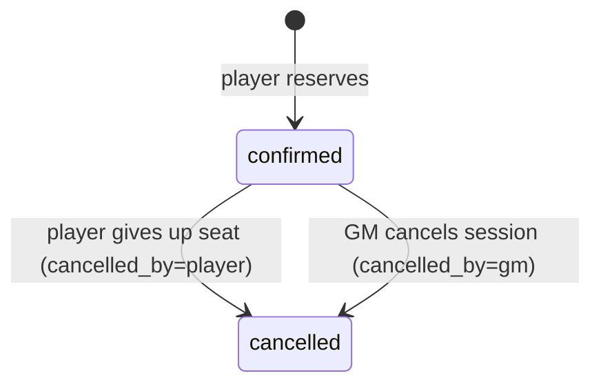

# 05 · Data Model

The authoritative DDL is `web/src/lib/schema.ts` (**schema version 6**: v6 adds `games.cover_image` and `users.avatar_image`, optional image paths back-filled with bundled art for demo rows. v3 re-seeded demo data for the D&D split; v4 replaced `gm_profiles.timezone` with `location` and is the migration baseline; v5 adds `rate_limits` through the first real migration in `web/src/lib/migrations.ts`, which keeps existing data). Timestamps are ISO-8601 UTC strings. **Money is whole Rupiah (IDR) as an integer.** The platform stores prices as information only and never processes payments.

## ERD


## Changes from v1 → v2

| v1 | v2 | Reason |
|---|---|---|
| `games.price_cents` (USD) | `games.price_idr` (whole Rupiah) | IDR, Indonesia only |
| `bookings.amount_cents`, `platform_fee_cents`, `payment_ref` | `bookings.price_idr` (informational snapshot) | No payments, 0% commission |
| `bookings.status` included `refunded` | `confirmed \| cancelled` + `cancelled_by` | Refunds are off-platform |
| `gm_profiles.payout_account` | `gm_profiles.payment_info` (free text) | GM tells players how to pay them |
| – | `games.language` | Bilingual market: play language per table |
| – | `PRAGMA user_version = 2` | Detect outdated local DBs |
| `gm_profiles.timezone` (IANA zone) | `gm_profiles.location` (v4: city or "Online") | GMs describe where they play; session times already use the browser clock |

## Constraints & indexes

| Object | Purpose |
|---|---|
| `users.email UNIQUE COLLATE NOCASE` | One account per email |
| `games.slug UNIQUE` | Stable URLs: made from the title while the game is an unpublished draft, then never changed (it is in shared links, emails and calendars) |
| `CHECK` on enums, price, seats, rating | Defence in depth |
| `uq_booking_active` — `UNIQUE(session_id, player_id) WHERE status='confirmed'` | One active seat per player per session |
| `reviews UNIQUE(game_id, player_id)` | One review per game |
| `idx_sessions_game`, `idx_bookings_session`, `idx_bookings_player`, `idx_games_status`, `idx_games_gm`, `idx_messages_game` | Query paths |
| `ON DELETE CASCADE` | Account and game erasure |

## Derived values

| Value | Computed as |
|---|---|
| Seats taken | `COUNT(bookings WHERE status='confirmed')` per session |
| Game / GM rating | `ROUND(AVG(rating), 1)` |
| Seats played (GM) | Confirmed seats in `completed` sessions |
| Expected income (GM) | Σ `bookings.price_idr` for confirmed seats in upcoming scheduled sessions |

## Booking lifecycle



## Seed data (Indonesia)
Every account uses the password `password123`.
- **GMs**, each with sample payment details:

  | GM | Email | Style / systems | Base |
  |---|---|---|---|
  | Raka Pradipta | `gm@` | horror (CoC, VtM, Mothership) | Jakarta, WIB |
  | Dewi Anggraini | `dewi@` | beginner fantasy (D&D, Daggerheart) | Bandung |
  | Bima Saputra | `bima@` | heist (Blades, Shadowrun) | |
  | Nadia Kusuma | `nadia@` | tactical (PF2e, Starfinder) | Makassar, WITA |

- **Players** (6), led by Andi Wijaya (`player@questboard.test`), plus `admin@questboard.test`.
- **10 games** with Rupiah prices from free to Rp 100.000. D&D is represented in both editions: *Naga-naga Hutan Bara* uses **D&D 5.5e (2024)** and *Mahkota yang Terbelah* uses **D&D 5e (2014)**.
  - Play languages: 5 Indonesian, 2 English, 3 bilingual.
  - Locations: online, plus in-person tables in Bandung and Yogyakarta.
  - Session times fall on WIB evenings (19.00–20.00) or weekend afternoons, relative to "now".
- **Reviews** are mixed ID and EN. The demo player has unreviewed past games so the review flow can be tried.

## Evolution (phase 2+)

| Change | Reason |
|---|---|
| `bookings.paid_marked_at` (GM-only toggle) | Help GMs track who has paid (still off-platform) |
| Tags/systems → join tables | Faceted search |
| ~~`users.locale`~~ | **Done in v13:** used for reminder emails |
| `notifications`, `waitlist_entries`, `reports`, `game_images` | Reminders, waitlists, moderation, covers |
| ~~Versioned migrations~~ | **Done in v5:** `PRAGMA user_version` ledger + ordered `MIGRATIONS`, with production refusing to reset |


## v7 (v0.9): categories & GM requests
```sql
ALTER TABLE games ADD COLUMN genres TEXT NOT NULL DEFAULT '';  -- CSV of genre keys, max 3
ALTER TABLE games ADD COLUMN styles TEXT NOT NULL DEFAULT '';  -- CSV of play-style keys, max 3

gm_requests(id, requester_id → users, gm_id → users NULL /* direct request */, title, system, group_size 1–12,
            experience_level, language, location_type, city, schedule, budget_idr ≥ 0, details,
            status open|matched|closed, matched_gm_id → users NULL, created_at)
gm_request_offers(id, request_id → gm_requests, gm_id → users, message, price_idr ≥ 0, created_at,
                  UNIQUE(request_id, gm_id))
gm_request_messages(id, request_id → gm_requests, sender_id → users, body, created_at)
```
- Migration 7 back-fills the demo games' categories by slug, but only where both columns are still empty.
- Category matching uses `(',' || genres || ',') LIKE '%,key,%'`.


## v8 (v0.9.1): notifications
```sql
notifications(id, user_id → users, kind, actor_id → users NULL, request_id → gm_requests NULL,
              session_id → game_sessions NULL, created_at, read_at NULL)
INDEX (user_id, read_at, created_at)
```

## v13 (v0.12): session reminders
```sql
ALTER TABLE users ADD COLUMN locale TEXT NOT NULL DEFAULT 'en' CHECK (locale IN ('en','id'));
ALTER TABLE users ADD COLUMN email_reminders INTEGER NOT NULL DEFAULT 1;
session_reminders(session_id → game_sessions, user_id → users, kind '24h'|'1h', sent_at,
                  PRIMARY KEY (session_id, user_id, kind))
```
- `users.locale` follows the language the person last used the site in (synced on each signed-in request), so emails and reminders arrive in that language.
- A `session_reminders` row is claimed (`INSERT OR IGNORE`) before anything is sent, so each reminder goes out exactly once even if two runs overlap.
- Notification kinds `session_reminder_24h` / `session_reminder_1h` go to booked players and the GM. Emails only go to verified addresses with `email_reminders = 1`.

## v14: cancellation messages
```sql
ALTER TABLE game_sessions ADD COLUMN cancel_reason TEXT NOT NULL DEFAULT '';  -- the GM's message when cancelling
```
- Shown to booked players in the `session_cancelled` notification, on My games, and in the cancellation email.
- Every cancellation path (the Cancel button, archiving, account deletion, moderation) creates `session_cancelled` notifications, which queue the cancellation email (`email_queue`). It is sent even to people with `email_notifications = 0` (`ALWAYS_EMAIL`), because they might otherwise turn up.

## v15: calendar feed
```sql
ALTER TABLE users ADD COLUMN calendar_token TEXT;  -- NULL until created in Settings
CREATE UNIQUE INDEX uq_users_calendar_token ON users(calendar_token);
```
- The token is the feed's only credential (read-only, public details only). "Reset link" replaces it, and account deletion clears it.

## v16: questions before booking
```sql
game_questions(id, game_id → games, player_id → users, created_at, last_message_at, UNIQUE(game_id, player_id))
game_question_messages(id, question_id → game_questions, user_id → users, body ≤ 1000, created_at)
ALTER TABLE notifications ADD COLUMN question_id INTEGER;  -- kind game_question, collapsed while unread
```
- One thread per player per game; only the player, the game's GM and admins can open it.

## v17: error log
```sql
error_log(id, created_at, message ≤ 1000, digest, method, path /* no query string */, route_path, route_type)
```
- Written by `src/instrumentation.ts` (`onRequestError`). `redirect()` and `notFound()` aren't logged. Pruned after 30 days by the cron route.

## v18: feedback and consent record
```sql
feedback(id, user_id → users NULL, email, kind bug|idea|other, body ≤ 2000, page, status new|done, created_at)
ALTER TABLE users ADD COLUMN terms_accepted_at TEXT;             -- set at sign-up
ALTER TABLE users ADD COLUMN terms_version TEXT NOT NULL DEFAULT '';  -- lib/legal.ts LEGAL_VERSION
```
- Bump `LEGAL_VERSION` whenever the Terms or Privacy Policy change materially. Existing accounts keep the version they agreed to.

## v19: notification emails
```sql
email_queue(id, notification_id → notifications ON DELETE CASCADE, created_at)
ALTER TABLE users ADD COLUMN email_notifications INTEGER NOT NULL DEFAULT 1;
```
- A queue row is claimed (deleted) before sending, so overlapping runs never send twice.

## v20: email retries and review prompts
```sql
ALTER TABLE email_outbox ADD COLUMN attempts INTEGER NOT NULL DEFAULT 0;
ALTER TABLE email_outbox ADD COLUMN retryable INTEGER NOT NULL DEFAULT 1;  -- 0 when the one-time link was blanked
review_prompts(game_id → games, player_id → users, sent_at, PRIMARY KEY (game_id, player_id))
```

## v21: changing a session's time
```sql
ALTER TABLE game_sessions ADD COLUMN reschedule_count INTEGER NOT NULL DEFAULT 0;  -- times the GM changed the time
```
- Changing the time (`rescheduleSessionAction`) keeps every booking, clears the session's `session_reminders` rows so reminders go out again for the new time, and sends booked players a `session_moved` notification and an email with the old and new time.
- The calendar feed and `.ics` files use it as `SEQUENCE`, so calendar apps replace the old time.

## v22: moderator action log
```sql
admin_log(id, admin_id → users (SET NULL), action, target_user_id → users (SET NULL), detail, created_at)
```
- `action` is one of `suspend`, `unsuspend`, `verify`, `unverify`, `report_remove`, `report_suspend`, `report_dismiss` (`AdminAction` in `lib/moderation.ts`). `detail` names the reported item and the moderator's note.
- The admin home lists the latest 15. It isn't in "Download my data" (it's the moderators' record); decisions that affect someone reach them as notifications (`content_removed`, `report_resolved`).

## v23: GM replies to reviews
```sql
ALTER TABLE reviews ADD COLUMN gm_reply TEXT NOT NULL DEFAULT '';  -- the game's GM answers publicly ('' = none)
ALTER TABLE reviews ADD COLUMN gm_replied_at TEXT;
```
- Only the game's GM can reply (`replyReviewAction`); an empty reply removes it. A first reply notifies the reviewer (`review_reply`). Replies show under the review on the game page and the GM's profile, and are in the GM's data export (`review_replies`).
- Reviews open once a session has **ended** (start + length) or the GM marked it played — not the moment it starts (`canReview`).

## v24: reporting GM replies, edited reviews
```sql
ALTER TABLE reviews ADD COLUMN edited_at TEXT;  -- the reviewer changed it after posting
-- reports is rebuilt (SQLite can't alter a CHECK) so target_type also accepts 'review_reply'
```
- A `review_reply` report points at the review's id; its owner is the game's GM. "Remove content" clears `gm_reply` and keeps the review.
- Reviewers can edit (`edited_at` is shown as "edited") or delete their own review; after deleting they may write a new one.

## v25: notices that come down soon
```sql
ALTER TABLE lfg_posts ADD COLUMN expiry_notified_at TEXT;  -- the author was reminded; cleared when they keep it up
```
- `remindExpiringNotices()` (cron and browse fallback) notifies the author (`notice_expiring`, emailed) once when an open notice has 3 days or less left. "Keep it up" (`renewNotice`) sets `expires_at` to 30 days from now and clears the reminder.

## v26: uploaded pictures
```sql
uploads(id, user_id → users (CASCADE), kind 'cover' | 'portrait', file UNIQUE, created_at)
```
- A GM can upload a game cover, and anyone a portrait, from the same forms as the library pictures (`coverUpload`, `avatarUpload`). The server checks the first bytes (JPEG, PNG or WebP only, ≤ 5 MB), then **re-encodes with sharp**: upright, cropped to 1600×800 (cover) or 512×512 (portrait), WebP. That drops hidden metadata such as a photo's GPS location and turns malformed or disguised files into a refusal.
- Files get random names (`<32 hex>.webp`) in `QUESTBOARD_UPLOAD_DIR` (default `data/uploads`) and are served only by `GET /uploads/{name}` (`image/webp`, immutable cache, `nosniff`).
- `games.cover_image` / `users.avatar_image` hold `/uploads/<name>`; the allow-list accepts it only if the uploader is the one saving (`ownsUpload`). A replaced picture is deleted (`discardUpload`); deleting an account deletes its uploads; admins can reset a portrait ("Reset picture", logged as `reset_portrait`). Uploads are in "Download my data".
- `npm run db:backup` also mirrors the upload folder into `<backup dir>/uploads`; `db:restore` puts missing pictures back.

## v27: app state
```sql
app_state(key PRIMARY KEY, value, updated_at)
```
- Small named values the app keeps between runs. Today only `error_digest_at`: when admins were last emailed the server-error digest (`src/lib/error-digest.ts`, sent by the cron at most every 20 hours, and only when there were new errors).

## v28: two-step login
```sql
users.totp_secret      -- base32 secret, set when setup starts
users.totp_enabled_at  -- NULL = off; set by the first correct code
users.totp_last_step   -- the last accepted code's 30-second step: each code works once
login_challenges(token_hash PRIMARY KEY, user_id → users (CASCADE), next_path, attempts, expires_at)
```
- Offered to admins in Settings. With it on, the right password creates a **login challenge** (10 minutes, the `qb_2fa` cookie; only its SHA-256 is stored) instead of a session; `/login/code` takes the 6-digit code (RFC 6238, one step of clock drift either way). Five wrong codes delete the challenge. A password reset also ends at the code step, and confirming an email never signs a two-step account in: an emailed link proves the inbox, not the phone.
- Offered to GMs as well since v29 (optional).

## v29: payment detail changes
```sql
payment_changes(id, user_id → users (CASCADE), changed_at)
```
- A row each time a GM replaces non-empty payment details with different ones (the first time they're set isn't a change). For 14 days (`PAYMENT_CHANGE_WARN_DAYS`) players see a warning next to the details; the admin GM list flags 2+ changes in 30 days. In "Download my data" (`payment_detail_changes`).

## v30: where you're logged in
```sql
auth_sessions.created_at, auth_sessions.last_seen_at, auth_sessions.device   -- "Chrome · Android" (lib/device.ts)
login_devices(user_id → users (CASCADE), device_hash, device, first_seen_at, last_seen_at, PRIMARY KEY (user_id, device_hash))
```
- `last_seen_at` is written at most every 10 minutes per session. Settings lists live sessions (`rowid` identifies one to log out).
- `qb_device` is a random, httpOnly, 2-year cookie; only its SHA-256 is stored. A login from an unknown one emails the account (not for its first device; `LIMITS.newDevice` 10/h). In "Download my data" (`login_devices`, without the hash).

## v31: automatic flags
## v32: policy update banner
```sql
users.legal_seen_version   -- the Terms/Privacy version whose "we've updated" banner they've seen
```
- Set to `LEGAL_VERSION` at sign-up, for demo accounts and for `npm run admin -- create`; the migration copies `terms_version`. When `LEGAL_VERSION` changes and `LEGAL_CHANGES` has a summary for it, signed-in people see a banner until they press "Got it".

## v33: time zone for emails
```sql
users.time_zone   -- IANA zone, default 'Asia/Jakarta'; emails show times in it (WIB / WITA / WIT, or Intl's name elsewhere)
```
- Set from the browser at sign-up (hidden `tz` field), changeable in Settings; invalid values fall back to Asia/Jakarta (`lib/time-zones.ts`). The website itself always shows the viewer's device time.
- Sessions slide: `auth_sessions.expires_at` moves to 30 days after the latest visit (written with `last_seen_at`, at most every 10 minutes).

## Retention (cron)
- `pruneSecurityRecords`: `login_devices` unused for a year, `payment_changes` older than a year, expired `login_challenges`.

- `reports` rebuilt so `reporter_id` may be NULL: an **automatic flag** (`autoFlag`, `lib/scam-signals.ts`) with `reason = 'scam'` and `details` = the matched signals (`credentials,newAccount,…`), shown in words in `/admin/reports`. One open automatic flag per piece of content.
- Not in "Download my data" (the secret is a credential; challenges last minutes). `npm run admin -- reset-2fa <email>` clears the three columns and the account's sessions and challenges.
