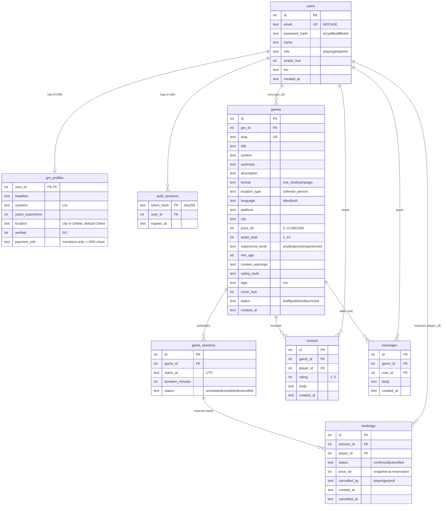
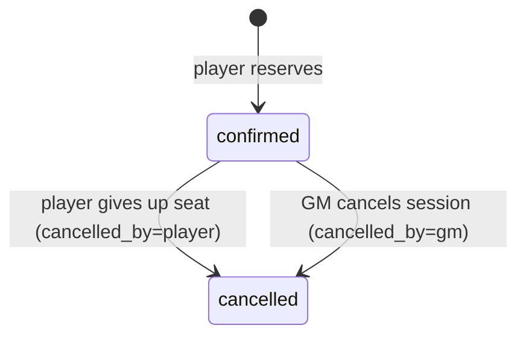

# 05 · Data Model

The authoritative DDL is `web/src/lib/schema.ts` (**schema version 6**: v6 adds `games.cover_image` and `users.avatar_image`, optional image paths back-filled with bundled art for demo rows. v3 re-seeded demo data for the D&D split; v4 replaced `gm_profiles.timezone` with `location` and is the migration baseline; v5 adds `rate_limits` through the first real migration in `web/src/lib/migrations.ts`, which keeps existing data). Timestamps are ISO-8601 UTC strings. **Money is whole Rupiah (IDR) as an integer.** The platform stores prices as information only and never processes payments.

## ERD



## Changes from v1 → v2

| v1 | v2 | Reason |
|---|---|---|
| `games.price_cents` (USD) | `games.price_idr` (whole Rupiah) | IDR, Indonesia only |
| `bookings.amount_cents`, `platform_fee_cents`, `payment_ref` | `bookings.price_idr` (informational snapshot) | No payments, 0% commission |
| `bookings.status` included `refunded` | `confirmed \| cancelled` + `cancelled_by` | Refunds are off-platform |
| `gm_profiles.payout_account` | `gm_profiles.payment_info` (free text) | GM tells players how to pay them |
| – | `games.language` | Bilingual market: play language per table |
| – | `PRAGMA user_version = 2` | Detect outdated local DBs |
| `gm_profiles.timezone` (IANA zone) | `gm_profiles.location` (v4: city or "Online") | GMs describe where they play; session times already use the browser clock |

## Constraints & indexes

| Object | Purpose |
|---|---|
| `users.email UNIQUE COLLATE NOCASE` | One account per email |
| `games.slug UNIQUE` | Stable URLs |
| `CHECK` on enums, price, seats, rating | Defence in depth |
| `uq_booking_active` — `UNIQUE(session_id, player_id) WHERE status='confirmed'` | One active seat per player per session |
| `reviews UNIQUE(game_id, player_id)` | One review per game |
| `idx_sessions_game`, `idx_bookings_session`, `idx_bookings_player`, `idx_games_status`, `idx_games_gm`, `idx_messages_game` | Query paths |
| `ON DELETE CASCADE` | Account and game erasure |

## Derived values

| Value | Computed as |
|---|---|
| Seats taken | `COUNT(bookings WHERE status='confirmed')` per session |
| Game / GM rating | `ROUND(AVG(rating), 1)` |
| Seats played (GM) | Confirmed seats in `completed` sessions |
| Expected income (GM) | Σ `bookings.price_idr` for confirmed seats in upcoming scheduled sessions |

## Booking lifecycle



## Seed data (Indonesia)
Every account uses the password `password123`.
- **GMs**, each with sample payment details:

  | GM | Email | Style / systems | Base |
  |---|---|---|---|
  | Raka Pradipta | `gm@` | horror (CoC, VtM, Mothership) | Jakarta, WIB |
  | Dewi Anggraini | `dewi@` | beginner fantasy (D&D, Daggerheart) | Bandung |
  | Bima Saputra | `bima@` | heist (Blades, Shadowrun) | |
  | Nadia Kusuma | `nadia@` | tactical (PF2e, Starfinder) | Makassar, WITA |

- **Players** (6), led by Andi Wijaya (`player@questboard.test`), plus `admin@questboard.test`.
- **10 games** with Rupiah prices from free to Rp 100.000. D&D is represented in both editions: *Naga-naga Hutan Bara* uses **D&D 5.5e (2024)** and *Mahkota yang Terbelah* uses **D&D 5e (2014)**.
  - Play languages: 5 Indonesian, 2 English, 3 bilingual.
  - Locations: online, plus in-person tables in Bandung and Yogyakarta.
  - Session times fall on WIB evenings (19.00–20.00) or weekend afternoons, relative to "now".
- **Reviews** are mixed ID and EN. The demo player has unreviewed past games so the review flow can be tried.

## Evolution (phase 2+)

| Change | Reason |
|---|---|
| `bookings.paid_marked_at` (GM-only toggle) | Help GMs track who has paid (still off-platform) |
| Tags/systems → join tables | Faceted search |
| ~~`users.locale`~~ | **Done in v13:** used for reminder emails |
| `notifications`, `waitlist_entries`, `reports`, `game_images` | Reminders, waitlists, moderation, covers |
| ~~Versioned migrations~~ | **Done in v5:** `PRAGMA user_version` ledger + ordered `MIGRATIONS`, with production refusing to reset |


## v7 (v0.9): categories & GM requests
```sql
ALTER TABLE games ADD COLUMN genres TEXT NOT NULL DEFAULT '';  -- CSV of genre keys, max 3
ALTER TABLE games ADD COLUMN styles TEXT NOT NULL DEFAULT '';  -- CSV of play-style keys, max 3

gm_requests(id, requester_id → users, gm_id → users NULL /* direct request */, title, system, group_size 1–12,
            experience_level, language, location_type, city, schedule, budget_idr ≥ 0, details,
            status open|matched|closed, matched_gm_id → users NULL, created_at)
gm_request_offers(id, request_id → gm_requests, gm_id → users, message, price_idr ≥ 0, created_at,
                  UNIQUE(request_id, gm_id))
gm_request_messages(id, request_id → gm_requests, sender_id → users, body, created_at)
```
- Migration 7 back-fills the demo games' categories by slug, but only where both columns are still empty.
- Category matching uses `(',' || genres || ',') LIKE '%,key,%'`.


## v8 (v0.9.1): notifications
```sql
notifications(id, user_id → users, kind, actor_id → users NULL, request_id → gm_requests NULL,
              session_id → game_sessions NULL, created_at, read_at NULL)
INDEX (user_id, read_at, created_at)
```

## v13 (v0.12): session reminders
```sql
ALTER TABLE users ADD COLUMN locale TEXT NOT NULL DEFAULT 'en' CHECK (locale IN ('en','id'));
ALTER TABLE users ADD COLUMN email_reminders INTEGER NOT NULL DEFAULT 1;
session_reminders(session_id → game_sessions, user_id → users, kind '24h'|'1h', sent_at,
                  PRIMARY KEY (session_id, user_id, kind))
```
- `users.locale` follows the language the person last used the site in (synced on each signed-in request), so emails and reminders arrive in that language.
- A `session_reminders` row is claimed (`INSERT OR IGNORE`) before anything is sent, so each reminder goes out exactly once even if two runs overlap.
- Notification kinds `session_reminder_24h` / `session_reminder_1h` go to booked players and the GM. Emails only go to verified addresses with `email_reminders = 1`.

## v14: cancellation messages
```sql
ALTER TABLE game_sessions ADD COLUMN cancel_reason TEXT NOT NULL DEFAULT '';  -- the GM's message when cancelling
```
- Shown to booked players in the `session_cancelled` notification, on My games, and in the cancellation email.

## v15: calendar feed
```sql
ALTER TABLE users ADD COLUMN calendar_token TEXT;  -- NULL until created in Settings
CREATE UNIQUE INDEX uq_users_calendar_token ON users(calendar_token);
```
- The token is the feed's only credential (read-only, public details only). "Reset link" replaces it, and account deletion clears it.

## v16: questions before booking
```sql
game_questions(id, game_id → games, player_id → users, created_at, last_message_at, UNIQUE(game_id, player_id))
game_question_messages(id, question_id → game_questions, user_id → users, body ≤ 1000, created_at)
ALTER TABLE notifications ADD COLUMN question_id INTEGER;  -- kind game_question, collapsed while unread
```
- One thread per player per game; only the player, the game's GM and admins can open it.
