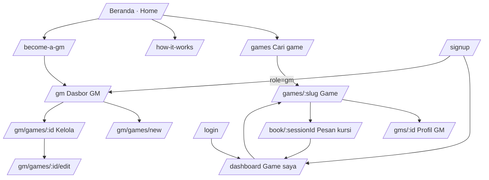

# 07 · UX / UI Specification

## 1. Sitemap

**Header**
- Logged out: logo · Find a game · Become a GM · **[EN | ID]** · Log in · **Sign up**
- Logged in: logo · Find a game · (GM dashboard) · **[EN | ID]** · My games · avatar · Log out

English is the default. The same header in Indonesian reads Cari game · Jadi GM · Masuk · Daftar, and so on.

The language switcher is a segmented control. The active language uses the accent fill and `aria-pressed="true"`.

## 2. Core flows

### Player: first reservation
1. Beranda: search or a system chip → **Cari game**, with filters including **Bahasa main**, **Harga maks. (Rp)** and **Saya pemula**.
2. Card → **Game page**: chips (format, location, play language, level, age) → description → info blocks (where, safety, content warnings, **Payment: "paid directly to the GM, 0% commission"**) → the session list in the sticky rail, where the price shows "Dibayar langsung ke GM · komisi 0%".
3. **Pesan** → (login if needed) → **Pesan kursimu**: a "Cara pembayaran" box explains "You pay Rp X directly to the GM". There are **no card fields**. The player ticks the checkbox and taps "Pesan kursi saya".
4. **Game saya**: a banner says the seat is reserved and points to the game page. The game page then shows **Sudah dipesan**, the **Cara bayar ke GM** card (the GM's bank or e-wallet text) and the **Chat meja**.
5. The player pays the GM outside the platform, and can post the transfer proof in the chat if the GM asks.

### GM: first listing
1. Jadi GM → sign up as *Jadi GM* → **Dasbor GM**.
2. "Ubah profil & detail pembayaran": headline, **location** (city or "Online"), bio, and **how players pay you** (e.g. "BCA … / GoPay … / QRIS", plus refund terms).
3. "Game baru": a form in 5 fieldsets.
   - The price field has an `Rp` prefix, defaults to `50.000`, and accepts dots.
   - A **Bahasa main** field.
4. Manage → schedule a session in local time → the roster appears. Afterwards: **Tandai sudah dimainkan**.

## 3. Key screens

| Screen | Primary action | Notes |
|---|---|---|
| Home | Search | Hero, system chips, starting soon, how it works (step 2: "Booking is free, pay the GM directly"), beginner games, GM call to action ("0% commission") |
| Browse | Apply filters | Pill radios for play language, format, location, experience. Rp max price. Free only |
| Game | Pesan / Book | Members additionally see **Cara bayar ke GM** (accent-bordered card) and **Chat meja** |
| Reserve | Pesan kursi saya | Payment explainer, rules checkbox, summary card with "Harga (dibayar ke GM)" |
| Game saya | Batalkan / Tulis ulasan | Upcoming rows have a "Pembayaran & chat" link. Cancelling reminds the player to settle refunds with the GM |
| Dasbor GM | Game baru | Tiles: Game aktif, Sesi mendatang, Pemain terdaftar, **Perkiraan pendapatan** (Rp, "paid to you directly") |
| Kelola game | Tambah sesi | "Rp X per kursi · 100% untukmu". Cancelling a session tells the GM how many seats are released |

## 4. Visual design system
Since v0.10 the design is a medieval tavern: parchment (light) and candlelit oak (dark) tokens, a dark-oak header and footer, Cinzel headings, Alegreya and Alegreya Sans text. See DESIGN.md and `web/src/app/globals.css`.

| Token | Light | Dark | Use |
|---|---|---|---|
| `--bg` | `#f7f4ee` | `#14110f` | Page |
| `--surface` / `--surface-2` | `#fff` / `#efe9df` | `#1d1916` / `#27211d` | Cards, chips |
| `--text` / `--muted` | `#1f1a17` / `#6b625a` | `#f3ece4` / `#a99d91` | Text |
| `--accent` | `#b4441f` | `#e8703f` | Primary actions, active language |
| `--gold` | `#b7862b` | `#e0b35a` | Stars |
| `--success` / `--danger` (+ `-soft`) | | | Notices, badges |

### Imagery
- Demo games have original illustrated covers and demo GMs have portraits (SVGs in `web/public/images/`, generated by `npm run placeholders`).
- Anything without art falls back to the hue-gradient cover or the initials avatar.
- The art rules (focal band for cropping, palette, portrait style) are in the root `DESIGN.md`.

### Iconography: Flaticon UIcons
- **Set:** Flaticon UIcons, *regular rounded* for UI and *solid rounded* for filled accents (stars, verified badge, logo die, "booked" check). Icons inherit the text colour (`currentColor`) so they follow the light/dark tokens.
- **Where they appear:**

  | Area | Icons |
  |---|---|
  | Header | d20 logo, search, wizard hat (GM), calendar (my games), globe (language), sign in / sign out |
  | Game cards & detail chips | one-shot = open book, campaign = scroll, laptop/marker for online vs in-person, language, seedling = beginner, graduation cap = experienced |
  | Info blocks | laptop/marker, shield-check (safety), triangle-warning (content warnings), handshake (payment) |
  | Actions | ticket = book/reserve, wallet = payment details, paper plane = send, calendar-plus = add session, pencil / eye / archive / cross-circle for manage, view, archive, cancel |
  | Status | notices (info / check-circle / warning), empty states and 404 (d20 in a tinted circle) |

- **Sizing:** icons follow the font size of their text. Feature icons sit in a 36–56 px tinted square (`bg-accent-soft text-accent`).
- **Accessibility:** icons are `aria-hidden` next to visible text. Icon-only controls (the header on mobile) carry an `aria-label`. The verified badge exposes its label.
- **Adding an icon:** find the name on flaticon.com/uicons, add it to `src/lib/icons.ts`, run `npm run icons`, then use `<Icon name="…" />`.
- **Attribution:** the footer shows "Ikon/Icons: Uicons by Flaticon", linking to https://www.flaticon.com/uicons. This is required by the free license.

Components: `btn-*`, `card`, `input`, `label`, `chip`, `eyebrow` utilities, plus `Avatar`, `Stars`, `Cover`, `GameCard`, `Notice`, `EmptyState`, `FieldError`, `SubmitButton`, `ConfirmButton`, `LocalTime`, `LanguageSwitcher`.

## 5. Content, voice & localisation

| | Bahasa Indonesia | English |
|---|---|---|
| Register | Friendly and informal (*kamu*, *-mu*), like a community host. Avoid stiff formal *Anda*. | Friendly and direct |
| Hero | "Temukan mejamu. Kenalan dengan Game Master-mu." | "Find your table. Meet your Game Master." |
| TTRPG terms | Keep common English loanwords used by the community: one-shot, session zero, X-card, lines & veils, GM, roleplay | – |
| Money | `Rp 75.000`, "Gratis" | `Rp 75.000`, "Free" |
| Dates | "Sab, 26 Sep, 19.00 WIB" | "Sat, 26 Sept, 19:00 GMT+7" |

Rules:
- Always state the consequence of an action. For example: "Lepaskan kursimu? Kalau sudah membayar, atur pengembalian dana dengan GM."
- Never imply that the platform holds money. Say "dibayar langsung ke GM", never "bayar di Quest Board".
- Keep strings short enough for 360 px screens. Indonesian runs about 10–20% longer than English, so layouts wrap rather than truncate.
- Add new strings in **both** languages: `lib/i18n/en.ts` and `lib/i18n/id.ts` (the compiler enforces this).

## 6. Accessibility
- `<html lang>` follows the active language, so screen readers use the correct voice.
- The language switcher has buttons with `aria-pressed` and a labelled form group.
- Plus everything from v0.1: skip link, labelled inputs, `role=alert`/`status`, focus rings, real radio inputs, star `aria-label`s (translated), and colour never used as the only signal.

## 7. Backlog
- Mobile bottom navigation. (On mobile the header already shows icon-only search, my games and GM links.)
- Show a "paid" checkmark on the GM roster.
- WhatsApp share button for game pages.
- Calendar view and `.ics` export.
- Waitlist.
- Onboarding quiz.
- Cover image uploads.

## 8. v0.9 screens
- **Header:** Find a game · Browse · Hire a GM (icon-only below `lg`). The avatar links to Settings.
- **Settings:** a single column of cards (Profile → Game Master → Password → Security). The portrait picker has a live preview.
- **Browse hub and category pages:** see DESIGN.md "Categories & hire page".
- **Hire a GM:** see DESIGN.md. The request page is a form with a sticky "How it works" aside on desktop.
- **Request detail:** facts list, then offers (requester) or the offer form (GM), then the private chat and payment card after a match.
- Verified at 360, 390, 768, 1024 and 1280 px in EN and ID, light and dark, with no horizontal scroll.

- **v0.9.1:** a bottom tab bar on phones, a notifications bell and the `/notifications` page (see DESIGN.md "Navigation & notifications"). Automated axe checks now run on the main pages.

- **v0.10:** the visual design is now a medieval tavern (see DESIGN.md "Personality", "Tokens", "Typography"). The bell opens a notifications popover.
