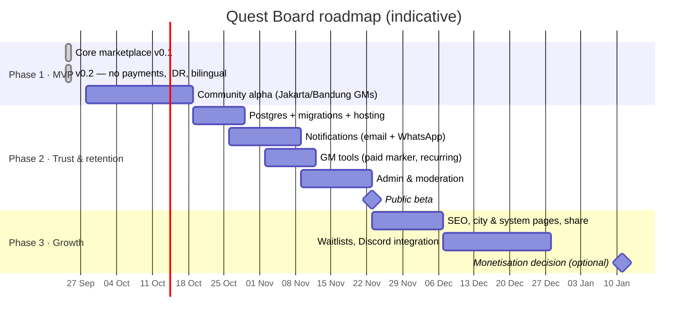

# 08 · Roadmap & Delivery Plan

## 1. Phases at a glance

## 2. Phase 1 · MVP (complete)

**v0.1:** the core marketplace loop.
**v0.2**, following stakeholder feedback:

| Change | Result |
|---|---|
| Payments & commission | Removed completely. The GM keeps 100%, and players pay GMs directly. GMs publish their own payment details, visible to booked players only |
| Currency | IDR throughout (`Rp 75.000`), with Indonesian seed data and WIB times |
| Language | Bilingual UI (ID default, EN), a play-language field and filter, translated errors |

**v0.3:** D&D split into **5e (2014)** and **5.5e (2024)**; **Flaticon UIcons** across the UI (subset font, credited in the footer); icon-only header navigation on mobile.

**v0.4:** **English is the default language**; the GM **Timezone** field is replaced by **Location** (city or "Online").

Quality: **27 unit tests + 13 e2e journeys, all passing**. Typecheck and lint are clean.

**Alpha exit criteria:**
- [x] All MVP stories ✅ in [02](02-personas-and-user-stories.md)
- [ ] 10 community GMs list real games, and 50 players reserve
- [ ] Native-speaker review of all Indonesian copy
- [ ] No P0/P1 bugs open for 7 days

## 3. Phase 2 · Trust & retention (≈ 5 weeks, 2 engineers)

| Epic | Stories | Estimate |
|---|---|---|
| **E1 Platform** | Postgres (e.g. Neon or Supabase in the Singapore region, for low latency to Indonesia) with versioned migrations; hosting; CI; Sentry; rate limiting | 8 pts |
| **E2 Notifications** | Transactional email: reservation, cancellation, GM new-player alert, 24h and 1h reminders. **WhatsApp** reminders through a WhatsApp Business API provider (most Indonesian users prefer WhatsApp). All sent in the user's language, which needs a `users.locale` column | 8 pts |
| **E3 GM tools** | "Paid ✓" toggle per seat (GM-only, still off-platform); recurring sessions (weekly campaigns); duplicate a game; export the roster | 5 pts |
| **E4 Trust & Safety** | Admin console (verify GMs, hide listings, suspend users); report button; GM replies to reviews; email verification; password reset; reliability indicator (late cancellations and no-shows) | 8 pts |

## 4. Phase 3 · Growth
- **Discovery:** landing pages per city (Jakarta, Bandung, Surabaya, Yogyakarta, Bali) and per system, structured data, a "share to WhatsApp / Instagram story" button, and optional `/en` and `/id` URL prefixes with `hreflang` for SEO (see ADR-7).
- **Community:** partner board-game cafés as in-person venues, a convention and event mode, and a Discord bot that invites booked players.
- **Retention:** waitlist with auto-offer, follow a GM, saved searches.
- **Monetisation decision point (optional, not planned).** Evaluate only after liquidity targets are met. Options: featured listings, a GM Pro tier, or an *opt-in* integrated payment (Midtrans or Xendit: QRIS, VA, e-wallet) for GMs who want it. Any of these needs a separate product and legal review (Bank Indonesia payment rules, tax).

## 5. Sprint plan for phase 2 (2-week sprints)

| Sprint | Focus | Demo |
|---|---|---|
| S1 | Postgres, migrations, CI, hosting, `users.locale` | App on staging with a real DB; language preference follows the account |
| S2 | Email + WhatsApp reminders, "paid" marker, recurring sessions | Player gets a WhatsApp reminder in Bahasa Indonesia 24h before; GM marks seats paid |
| S3 | Admin console, reports, password reset, reliability | Admin verifies a GM; a report reaches the queue |

**Definition of Done:**
- Code reviewed.
- Unit tests for new rules.
- e2e updated for changed journeys.
- **New UI strings added in both ID and EN**, with Indonesian reviewed by a native speaker.
- Accessible.
- Docs updated.
- Deployed to staging.

## 6. Team (suggested)

| Role | FTE | Responsibility |
|---|---|---|
| Product / community lead | 0.5–1 | GM recruitment in local communities (Discord servers, game stores), roadmap |
| Full-stack engineers | 2 | Features, infrastructure |
| Designer / copywriter (ID + EN) | 0.5 | UX, bilingual copy |
| Moderation / support | 0.5 (from beta) | GM verification, reports |

## 7. Risks & mitigations

| Risk | L | I | Mitigation |
|---|---|---|---|
| Chicken-and-egg (no GMs means no players) | High | High | Recruit 30 founding GMs from local communities; 0% commission is the main pitch; encourage free intro games |
| Payment disputes between player and GM (off-platform) | Med | Med | Clear copy that Quest Board doesn't handle money; GMs state refund terms; reviews and reports; admin can suspend repeat offenders |
| Scams (fake GM collects transfers) | Low–Med | High | Payment details shown only after reservation; verified badge; reports; limit new unverified GMs to lower prices or free games (phase 2 option) |
| No-shows (free reservation means low commitment) | Med | Med | WhatsApp reminders; reliability indicator; GMs may ask for payment before the session |
| Unsafe behaviour at tables | Med | High | Safety tools on listings; reporting; code of conduct |
| Translation quality or drift | Med | Low | Typed keys + tests; native-speaker review in the DoD |
| Future monetisation friction after launching free | Med | Med | Keep core listings free forever; any paid features are optional add-ons |
